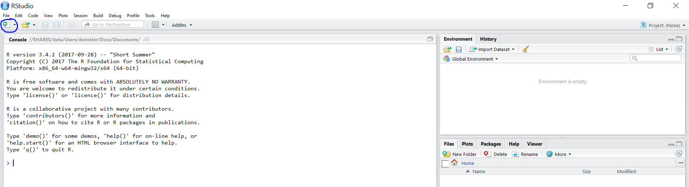
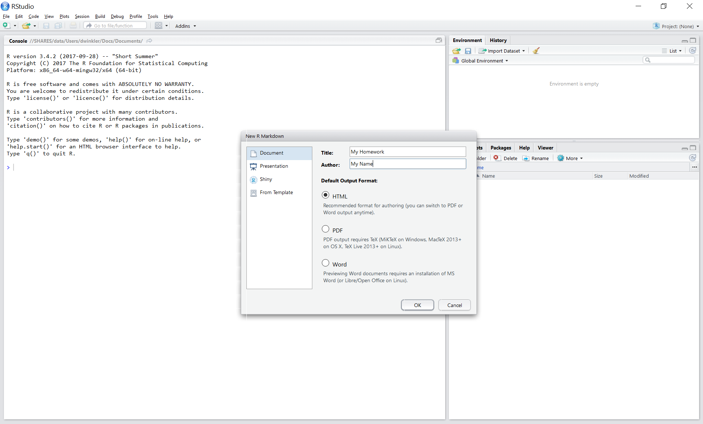
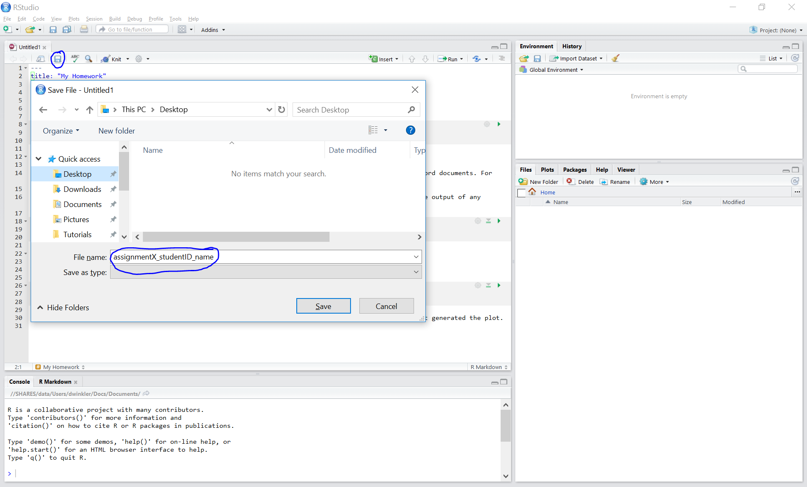
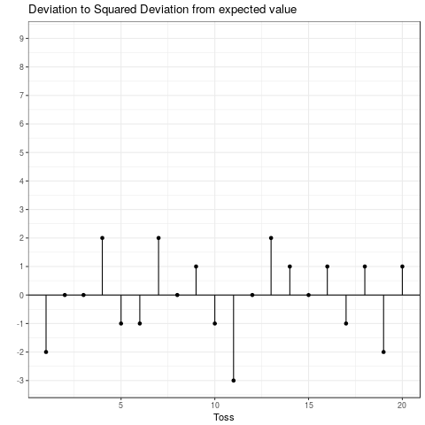

```{r, eval = TRUE, echo = FALSE, warning=FALSE, message = FALSE}
reqPackages <- c("multcomp", "lm.beta", "pastecs", "cowplot", "stringr", "gtrendsR", "gridExtra", "car", "jsonlite", "PMCMR", "plotly", "Ecdat", "knitr", "dplyr", "kableExtra", "reshape2", "haven", "readxl", "Hmisc", "pwr", "ggplot2", "grid", "psych", "lubridate", "ggExtra", "mfx", "ggthemes", "logistf", "bookdown", "ggmap", "devtools", "latex2exp", "rvest", "plyr", "GPArotation")
reqPackages <- reqPackages[!reqPackages %in% installed.packages()]
lapply(reqPackages, install.packages)
```

# Welcome! {-}

This is an introduction to statistics using the statistical software R presented by the Institute for Interactive Marketing and Social Media at WU Vienna.<br>
<br><br>
<p style="text-align:center;"></p>. 
<br>
The tutorial is intended to facilitate the learning process by summarizing the content that was covered in class. It includes the code files that we used during each session, along with the commented outputs and explanations in text and video format. You can use it as a reference for this course but also for other courses that you will take throughout your studies.  
<br>
<br>

# Course materials {-}

### Main reference {-}

<p style="text-align:center;"></p>

* __"[Discovering Statistics Using R](https://www.amazon.de/Discovering-Statistics-Using-Andy-Field/dp/1446200469)"__ (Field, A., Miles, J., & Field Zoe, 2012, 1st Edtn.) This textbook offers an accessible and comprehensive introduction to statistics and will be the main reference for this class. 
  
### Further readings {-}

<p style="text-align:center;">
&nbsp;
&nbsp;
&nbsp;
&nbsp;
&nbsp;


</p>

In addition to the main readings, there are many excellent books available (many of them for free) that focus on different aspects of R. In case you would like to learn more about the capabilities of R, I can recommend the following books:

* __"[R for Data Science](http://r4ds.had.co.nz/)"__ An excellent book by Hadley Wickham, which introduces you to R as a tool for doing data science, focussing on a consistent set of packages known as the tidyverse. [FREE online version]

* __"[An Introduction to Statistical Learning](http://www-bcf.usc.edu/~gareth/ISL/)"__ This book provides an introduction to statistical learning methods and covers basic methods (e.g., linear regression) as well as more advanced methods (e.g., Support Vector Machines). [FREE online version]

* __"[R for Marketing Research and Analytics](http://r-marketing.r-forge.r-project.org/)"__ A great book that is designed to teach R to marketing practitioners and data scientists.

* __"[Text Mining with R](http://tidytextmining.com/)"__ This book explains how you can analyse unstrunctured data (texts) using R. [FREE online version]

* __"[Advanced R](http://adv-r.had.co.nz/)"__ another great book written by Hadley Wickham. Explains more advanced R concepts. [FREE online version]

* __"[Using R For Introductory Econometrics](http://www.urfie.net/read/mobile/index.html#p=1)"__ This book covers a nice introduction to R with a focus on the implementation of standard tools and methods used in econometrics. [FREE online version]

* __"[R Packages](http://r-pkgs.had.co.nz/)"__ which teaches you how to make the most of R's fantastic package system. [FREE online version]

* __"[More books](http://ucanalytics.com/blogs/learn-r-12-books-and-online-resources/)"__ For more recommendations, please refer to this list of excellent books on specific topics related to R

### DataCamp {-}

<p style="text-align:center;">
&nbsp;
</p>

Please also make use of the abundance of web resources. For students who would like to further train the materials covered in class, we recommend DataCamp, an online platform that offers interactive courses in data science at different levels. To facilitate the learning process you will obtain full access to the entire DataCamp course curriculum for the duration of the course. 

* __"[https://campus.datacamp.com/courses/free-introduction-to-r](https://campus.datacamp.com/courses/free-introduction-to-r)"__ free interactive tutorials


### Other web-resources {-}

* __"[https://www.r-project.org/](https://www.r-project.org/)"__ official website
  
* __"[http://www.statmethods.net/](http://www.statmethods.net/)"__ R reference by the author of “R in action”

* __"[http://www.rdocumentation.org/](http://adv-r.had.co.nz/)"__ R documentation aggregator

* __"[http://stackoverflow.com/](http://stackoverflow.com/)"__ general discussion forum for programmers incl. R
  
* __"[http://stats.stackexchange.com/](http://stats.stackexchange.com/)"__ discussion forum on statistics and data analytics

* __"[http://www.r-bloggers.com/](http://www.r-bloggers.com/)"__ R blog aggregator

* __"[http://www.cookbook-r.com/](http://www.cookbook-r.com/)"__ useful examples for all kind of R problems

* __"[http://docs.ggplot2.org/0.9.3/index.html](reference graphics package “ggplot2”)"__ useful examples for all kind of R problems

<!--chapter:end:index.rmd-->

---
title: "01a-advanced data handling"
output:
  html_document:
    toc: yes
    df_print: paged
  html_notebook: default
  pdf_document:
    toc: yes
---
```{r, echo=FALSE}
library(knitr)
library(dplyr)
library(stringr)
options(scipen = F)
#This code automatically tidies code so that it does not reach over the page
opts_chunk$set(tidy.opts=list(width.cutoff=50),tidy=FALSE, rownames.print = FALSE, rows.print = 10, eval = TRUE, warning = FALSE, message = FALSE)


top10_track_streams <- c(163608, 126687, 120480, 110022, 108630, 95639, 94690, 89011, 87869, 85599) 
top10_artist_names <- c("Axwell /\\ Ingrosso", "Imagine Dragons", "J. Balvin", "Robin Schulz", "Jonas Blue", "David Guetta", "French Montana", "Calvin Harris", "Liam Payne", "Lauv") # Characters have to be put in ""
top10_track_explicit <- c(0,0,0,0,0,0,1,1,0,0)
top10_track_explicit <- factor(top10_track_explicit, 
                               levels = c(0:1), 
                               labels = c("not explicit", "explicit"))
top10_artist_genre <- c("Dance","Alternative","Latino","Dance","Dance","Dance","Hip-Hop/Rap","Dance","Pop","Pop")
top10_artist_genre <- as.factor(top10_artist_genre)
top_10_track_release_date <- as.Date(c("2017-05-24", "2017-06-23", "2017-07-03", "2017-06-30", "2017-05-05", "2017-06-09", "2017-07-14", "2017-06-16", "2017-05-18", "2017-05-19"))
top10_track_explicit_1 <- c(FALSE,FALSE,FALSE,FALSE,FALSE,FALSE,TRUE,TRUE,FALSE,FALSE)  

music_data <- data.frame(top10_track_streams, 
                         top10_artist_names, 
                         top10_track_explicit, 
                         top10_artist_genre, 
                         top_10_track_release_date, 
                         top10_track_explicit_1,
                         stringsAsFactors = FALSE)

```


# Advanced data handling

This chapter covers more advanced techniques for handling data in R.

## The dplyr package

There are many ways to achieve the same thing in R. Data transformation and handling tasks can be solved with the functions provided by base R, but the ```dplyr```package offers a comprehensive suite of functions that makes many tasks easier, while keeping code very readable. As such we will be presenting it here, but keep in mind that all of these tasks could also be achieved without any packages. 

Before we continue, ensure that the ```dplyr()``` package is installed and loaded. 

### Filter rows

One of the most basic tasks one could wish to perform on a dataset is select certain observations based on various characteristics. ```dplyr``` uses the ```filter()``` function to this end. To select certain rows from a dataset you simply supply the data frame as the first argument and then tell ```filter()``` the logical criteria it should use to select observations. While this may sound fairly abstract, it will become very clear after a few examples.

Recall the ```music_data``` data frame from the previous chapter. Suppose we want to select only observations where the lyrics are not explicit. The code to achieve this would looks as follows:

```{r message=FALSE, warning=FALSE}
filter(music_data, top10_track_explicit == "not explicit")
```

The first argument supplied to the ```filter()``` function is the data frame we want to subset. The second argument tells ```filter()``` that we only want observations where the column ```top10_track_explicit``` is equal to the value ```"not explicit"```. If you look into the output you will notice that only tracks with non explicit lyrics have been returned.

Another way to filter observations is to choose all observations where one column is within a certain range. This can be achieved with the logical operators introduced in the basic data handling chapter. In the following example we select all tracks with less than 100000 streams. 

```{r message=FALSE, warning=FALSE}
filter(music_data, top10_track_streams < 100000)
```

You can enforce multiple conditions with ```&```. The following example selects all observations with less than 150000 but more than 100000 streams.

```{r message=FALSE, warning=FALSE}
filter(music_data,  top10_track_streams > 100000 & top10_track_streams < 150000)
```

The ```|``` symbol is the way R expresses "or". This way you can select observations that fulfill either one or the other condition. Say we would like to select all observations with less than 100000 or more than 150000 streams. The following code would do exactly that
```{r message=FALSE, warning=FALSE}
filter(music_data,  top10_track_streams < 100000 | top10_track_streams > 150000)
```

A very useful feature of the ```filter()``` function is its ability to accept multiple criteria at once. Say we want to select all tracks marked as ```"not explicit"``` with less than 100000 streams. This can be achieved by simply supplying the function with additional arguments, as in the example below. 

```{r message=FALSE, warning=FALSE}
filter(music_data, top10_track_explicit == "not explicit", top10_track_streams < 100000)
```

Below is an interactive version of the last command with the dataset preloaded. Feel free to experiment with various ways to specify rows to be extracted to get a feel for how the filter function works.

<iframe src="http://localhost:3838/dplyr_filter/?showcase=0" width="800" height="500",  frameBorder = 0>
</iframe>

### Select columns

Another common task is to select or exclude certain columns of a data frame. The ```dplyr``` package contains the ```select()``` function for exactly this purpose. Similarly to ```filter()``` you first supply the function with the data frame you wish to apply the selection to, followed by the columns you wish to select or exclude. 

The following code selects the two columns ```top10_track_explicit``` and  ```top10_track_streams``` from the ```music_data``` dataset. 

```{r message=FALSE, warning=FALSE}
select(music_data, top10_track_explicit, top10_track_streams)
```

To remove columns from a data frame you simply put a ```-``` before the column name. 

```{r message=FALSE, warning=FALSE}
select(music_data, -top10_track_explicit, -top10_track_streams)
```

You can also select or exclude a whole range of columns through numbers or names. 

```{r message=FALSE, warning=FALSE}
# Selects all columns from top10_track_explicit to top_10_track_release_date
select(music_data, top10_track_explicit:top_10_track_release_date)

# This is equivalent to  
select(music_data, 3:5)

```

Below you will again find an interactive version to experiment with. 

<iframe src="http://localhost:3838/dplyr_select/?showcase=0" width="800" height="500",  frameBorder = 0>
</iframe>

### Rename columns

Renaming of columns is done with a special version of the ```select()``` function called ```rename()```. The syntax may seem familiar at this point, with the first argument being the data frame to apply the function to and the following arguments being the transformations to apply. The example changes the names of the ```top10_track_explicit``` and ```top10_artist_names``` columns into ```explicit``` and ```names```, respectively.

```{r message=FALSE, warning=FALSE}
rename(music_data, explicit = top10_track_explicit, names = top10_artist_names)
```

### Arrange rows

If you just want to change the order of a data frame without discarding any observations or columns, you can use the ```arrange()``` function. It takes a data frame and a set of column names to order by, always in ascending order. If you provide more than one column name, each additional column will be used to break ties in the values of preceding columns.

```{r message=FALSE, warning=FALSE}
arrange(music_data, top10_artist_genre, top10_track_streams)
```

If you wish to arrange them in descending order, you can wrap the column name in the ```desc()``` function. 

```{r message=FALSE, warning=FALSE}
arrange(music_data, top10_artist_genre, desc(top10_track_streams))
```

Below you will again find an interactive version of the ```arrange()``` function to experiment with. 

<iframe src="http://localhost:3838/dplyr_arrange/?showcase=0" width="800" height="500",  frameBorder = 0>
</iframe>

### Adding and changing variables

There are two functions to create new variables based on other variables in the dplyr package, ```mutate()``` and ```transmute()```. They both do the same thing, with one key difference: ```mutate()``` returns both the newly created variables _and_ the ones previously contained in the data frame, while ```transmute()``` only returns the newly created variables. 

Both functions take variables already present in the dataset and apply a function to them to generate new variables. This can be something as simple as adding 1 to every entry in a column or more complex procedures, like standardising variables. The syntax is fairly straightforward: The first argument is the data frame we wish to apply the transformation to, and all the following arguments are the new variables we want to create. An exapmle will make this clearer. Say we (for some reason) want to add 10 to every entry of the ```top10_track_streams``` column in our dataset. The code to do this would look as follows:
```{r, message=FALSE, warning=FALSE}
mutate(music_data, streams_plus_10 = top10_track_streams + 10)
```

This code essentially defines a new column named ``` streams_plus_10```, which is the column ```top10_track_streams``` + 10. 

As previously mentioned, we can also perform more complex operations, such as standardising variables (i.e. subtracting the mean value and dividing by the standard deviation). Note that we are generating the mean and the standard deviation in our code by applying functions (```mean()``` and ```sd()```) to the entire column and then we use these values to perform the standardisation on _each_ value of the column.

```{r, message=FALSE, warning=FALSE}
mutate(music_data, streams_standardised = (top10_track_streams - mean(top10_track_streams))/ sd(top10_track_streams)) 
```

You can also add other vectors to an existing data frame with mutate, given that it is the same length as the data frame you want to add it to. 

```{r, message=FALSE, warning=FALSE, echo=FALSE}
set.seed(123)
```

```{r, message=FALSE, warning=FALSE}
# Generate random data with 10 rows
extra_column <- rnorm(nrow(music_data))

mutate(music_data, new_data = extra_column) 
```

### Changing variables

If you don't want to add a whole new variable and only want to edit a variable already present in the data frame, ```dplyr``` has you covered with the ```mutate_at()``` function. The practical thing about this function is that it can also be applied to a whole range of variables if you want to perform the same operation on multiple columns. To do this, you give the function not just a single column name, but a whole vector of column names. 

Say we first want to change the type of a single column. For example, maybe we want ```top10_track_explicit``` to be a character column and not a factor. We again tell ```mutate_at()``` which data frame we want to change, followed by the column(s) to change and finally the function we want to apply. You may have noticed that the column name is in quotation marks here, as opposed to the other functions we have met from the ```dplyr```package. This is a side effect of its ability to apply a function to a range of columns and not just a single one, as this can only be achieved via a character vector. So from a technical standpoint we are giving the ```mutate_at()``` function a character vector of length one, solely containg the element ```"top10_track_explicit"```.

```{r, message=FALSE, warning=FALSE}
mutate_at(music_data, "top10_track_explicit", as.character)
```

Now say we want to change multiple columns to be character vectors. To do this we will first create a vector of the names of the columns we want to apply the function to and then simply give ```mutate_at()```this vector as one of its arguments. If you do this, don't forget the ```c()``` function to create a vector. 

```{r, warning=FALSE, message=FALSE}
columns <- c("top10_track_explicit", "top10_artist_genre", "top10_track_explicit_1")

mutate_at(music_data, columns, as.character)
```

Below is again a version for you to experiment with. The vector ```extra_column``` from the last example has also been loaded into the environment, so you can try adding a whole new vector to the data frame. 

<iframe src="http://localhost:3838/dplyr_mutate/?showcase=0" width="800" height="500",  frameBorder = 0>
</iframe>

### Pipes

A very practical feature of the dplyr package are so called "pipes". Say you want to apply three of the previously mentioned functions to the same data frame. So far, the way we learned to do this would be as follows:


```{r, message=FALSE, warning=FALSE}
# First use select() to take only certain columns
music_data_new <- select(music_data, top10_track_explicit_1, top10_artist_names, top10_track_streams)

# Now use filter() to choose only rows that fulfill certain criteria 
music_data_new <- filter(music_data_new, top10_track_streams < 100000)

# Then change order with arrange()
music_data_new <- arrange(music_data_new, top10_track_streams)

# Print to console
music_data_new
```

While this does achieve our objective, it is quite tedious. With the pipes offered by ```dplyr```, you can chain these commands together to streamline your code, while keeping it very readable. The symbol for a pipe is ```%>%```. From a technical perspective, this hands the preceding object to the next function as the first argument. This may sound complicated, but will become clear after an example. The code below will create exactly the same data frame as the example above, but in a much more compact form.

```{r, message=FALSE, warning=FALSE}
music_data_new <- music_data %>%
  select(top10_track_explicit_1, top10_artist_names, top10_track_streams) %>%
  filter(top10_track_streams < 100000) %>%
  arrange(top10_track_streams)

# Print to console
music_data_new
```

Let's unpack what happened here. The first line "pipes" ```music_data``` into the first function, ```select()```, which is in the second line. Here we remove all columns except for ```top10_track_explicit_1```, ```top10_artist_names``` and ```top10_track_streams```. Then we take this data frame with the reduced columns and hand it to ```filter()```, which only selects observations with less than 100000 streams. Finally, we pass the filtered, column reduced data frame to arrange, which orders the rows by the number of streams per track. The assigment operator (```<-```) at the top then saves this data frame in the environment as ```music_new_data```. Note that, in contrast to the previous examples, we no longer have to specify which data frame we want to apply the various functions to, as the pipes take care of this for us.

Again, experiment with this feature below and it will quickly become very intuitive.

<iframe src="http://localhost:3838/dplyr_pipes/?showcase=0" width="800" height="500",  frameBorder = 0>
</iframe>

### Creating custom summaries

The ```summarise()``` function lets you build customised summaries of your data. This can range from creating means and standard deviations of certain variables to simply counting how many observations are in a data frame. Say we want to find out the mean and standard deviation of the number of streams and also count the number of observations. With ```summarise()``` that would look as follows:

```{r, message=FALSE, warning=FALSE}
summarise(music_data, nObservations = n(), mean_streams = mean(top10_track_streams), sd_streams = sd(top10_track_streams))
```

On its own, this function is not that impressive. After all, we could just apply the ```mean()```, ```sd()``` and ```nrow()``` functions individually and would have gotten the same result, albeit not in such a nice format. 

However, when combined with the ```group_by()``` function, ```summarise()``` becomes very useful. ```group_by()``` splits a data frame into groups, by the values of a column in the data frame. Say we wanted to calculate the mean and standard deviation of explicit and non-explicit songs seperately. 

```{r, message=FALSE, warning=FALSE}
music_data %>%
  group_by(top10_track_explicit) %>%
  summarise(nObservations = n(), mean_streams = mean(top10_track_streams), sd_streams = sd(top10_track_streams))
```

This is a useful tool for getting a good overview of your data and potentially generating data for visualizations or tables. 

<iframe src="http://localhost:3838/dplyr_summarise/?showcase=0" width="800" height="500",  frameBorder = 0>
</iframe>

## Dealing with strings

Strings (which is short for "character strings"), can be tough to deal with. They are unstructured, messy and getting them into a format that one can perform analysis with is often a task that requires a lot of time. However, seeing as they appear fairly frequently in datasets and often contain valubale information, it is definitiely worth the time to learn how to deal with them.

### The ```stringr``` package

A very accesible package for manipulating strings is the ```stringr``` package. It is designed to be as uniform as possible, meaning that once you have understood the basic syntax of any one of its functions it is very easy to apply any of its functions. It sacrifices some flexibility for this simplicity, so if you ever encounter a task you can not easily solve with ```stringr``` it is worth checking out the package it is built on, ```stringi```. For now, however, ```stringr``` will be more than sufficient. 

The majority of functions in ```stringr``` are built around two core arguments: a string to be worked on and a pattern. There are quite a few that aren't, such as ```str_length()```, but these are (for the most part) fairly self explanatory and will not be explained further here. A good overview of the included functions can be found [here](https://github.com/rstudio/cheatsheets/raw/master/strings.pdf).

The string to be worked on can either be an individual string in quotation marks or an entire vector or column of strings that the same operation should be applied to. The pattern can _technically_ also be a vector of patterns to look for, however, in this tutorial we will only use single patterns. 

Recall the list of artist names in the ```music_data``` data frame.

```{r, message=FALSE, warning=FALSE}
music_data$top10_artist_names
```

Say, for example, we want to see which names contain a "g". ```stringr``` contains the function ```str_detect```, which tells you exactly that. Note that these functions are all case sensitive, i.e. the "G" in "David Guetta" is not detected. 

```{r, message=FALSE, warning=FALSE}
str_detect(string = music_data$top10_artist_names, pattern = "g")
```

Say we want to be a bit more specific and want to know _exactly_ where the g is located in each artist name. ```str_locate_all``` returns a list of start and end values for each entry in the character vector.

```{r, warning=FALSE, message=FALSE}
str_locate_all(string = music_data$top10_artist_names, pattern = "g")
```

This obviously also works for patterns longer than just one letter.

```{r}
str_locate_all(string = music_data$top10_artist_names, pattern = "vin")
```

Another common task is to replace all instances of one character with another character. Say, for example, we want to replace all occurences of "a" with "b". The function ```str_replace_all()``` does exactly that. Note that there is also a function called ```str_replace()```, but this only replaces the *first*  match that the pattern finds. 

```{r, message=FALSE, warning=FALSE}
str_replace_all(music_data$top10_artist_names, pattern = "a", replacement = "b")
```

A common application for this function is to replace all "." with "," or vice versa in price data. R, for example, needs the decimal seperator to be a ".", so if you want to perform numerical analyses on price data that isn't in a uniform format, this function can be very useful. 

Say we want to replace all "." with "," in the artist names.

```{r, message=FALSE, warning=FALSE}
str_replace_all(music_data$top10_artist_names, pattern = ".", replacement = ",")
```

This result may be somewhat surprising. Why did the function replace _every_ character with "," even though we specified ```pattern = "."```? The explanation for this can be found in how the function matches patterns.

### A crash course in regex

Behind the scenes ```stringr``` uses something called regex (short for "regular expressions") to match patterns. regex allows you to match not just individual letters, but more abstract patterns. It does this by using special characters that do not match literally. You have already met the first such special character ".", which is regex's version of a wildcard, meaning that it matches _any_ other character. That's why, when we told stringr to replace all dots with commas, it replaced every character with a comma. 

This raises the question of what to do if we want to literally match a dot and not any character. There are two ways to go about this. First, we could *escape* the wildcard character. What this means is that we use another special character to tell regex that the next character is meant to be taken literally and not as a wildcard. The symbol for this is a double back slash "\\\\". So, if we wanted to change only the dot to a comma we would write

```{r, message=FALSE, warning=FALSE}
str_replace_all(music_data$top10_artist_names, pattern = "\\.", replacement = ",")
```

The second way to achieve this would be by passing the pattern string through the ```fixed()``` function, which tells ```stringr``` that it should take the entire string literally. This means that the following code achieves the same result as using "\\\\".

```{r, message=FALSE, warning=FALSE}
str_replace_all(music_data$top10_artist_names, pattern = fixed("."), replacement = ",")
```

#### Other special characters in regex

We will quickly go through the most important regex special characters. Be aware that this list is by no means exhautive and is only meant to give you some basic tools that can help you with string manipulation. Keep this in mind if a regex is displaying unexpected behaviour, as it could be due to some wildcard you are not aware of. If all else fails you can always used the ```fixed()``` function to just match literal strings. 

##### Square brackets ```[]```

Square brackets can be used to match from a set of different letters. This means that ```[abc]``` will match a, b or c. The following code will replace a, b or c with a capital X. 
```{r}
str_replace_all(music_data$top10_artist_names, pattern = "[abc]", replacement = "X")
```

Note again that this is case sensitive, meaning that A, B and C are not replaced. However, square brackets are a great way to replace both capitalized and non-capitalized occurences at once.

```{r}
str_replace_all(music_data$top10_artist_names, pattern = "[ABCabc]", replacement = "X")
```

If you include a ```^``` in the beginning of a square bracket pattern, regex will interpret that to mean any character _except_ the ones in brackets. This means that if we take the same code as before and include a ```^```, all letters except for A, B and C (and their non-capitalized counterparts) will be replaced by a capital X.

```{r}
str_replace_all(music_data$top10_artist_names, pattern = "[^ABCabc]", replacement = "X")
```

##### Repetition operators: ```*```,```+``` and ```{}```

Repetition operators can be used to match the same character (or set of characters) multiple times. ```+``` matches a character one or more times, ```*``` matches a character zero or more times and with ```{}``` you can specfiy the range that matches can occur in.
```{r}
vector <- c("", "a", "aa", "aaa", "aaaa")
```
```{r}
# Replace one or more a with an X
str_replace(vector, pattern = "a+", replacement = "X")
```
```{r}
# replace zero or more a with an X
str_replace(vector, pattern = "a*", replacement = "X")
```
```{r}
# replace exactly two a with an X
str_replace(vector, pattern = "a{2}", replacement = "X")
```
```{r}
# replace two to three a with an X
str_replace(vector, pattern = "a{2,3}", replacement = "X")
```

Note that the ```+``` and ```*``` operators are "greedy", meaning that they try to match as much as possible, which can often lead to unintended consequences. It is often a good practice with regex to be as specific as possible while remaining as general as needed.

##### Parentheses: ```()```

Parentheses are used to create groups. Groups always match in their entirety and can be combined with other operators. 

```{r}
vector <- c("abc", "abcabc", "123abc", "abcabcabc")

str_replace_all(vector, pattern = "(abc){2}", replacement = "X")

```

The pattern ```"(abc){2}"``` will match only ```"abcabc"```, seeing as it looks for matches that repeat the group ```"(abc)"``` twice. 

##### Optional characters: ```?```

The question mark tells regex that the preceding character is optional for a match.  

```{r}
vector <- c("abc", "ac")

str_replace_all(vector, pattern = "abc", replacement = "X")
```

As expected, this only replaces the first element of the vector, as the second (```"ac"```) is not an exact match.

```{r}
str_replace_all(vector, pattern = "ab?c", replacement = "X")
```

By including ```?``` after the b, we tell regex that it is optional, i.e. that both ```"abc"``` and ```"ac"``` are correct matches. This can also be applied to groups and sets. 

##### Anchors: ```^``` and ```$```

Anchors can be used to specify that a match should only occur at the very beginning or end of a character string, with ```^``` and ```$``` standing for the beginning and the end, respectively. Note that the ```^``` operator has a different meaning inside square brackets (```[]```), as discussed above.  

```{r}
vector <- c("abc123", "123abc")

str_replace_all(vector, pattern = "^abc", replacement = "X")
```

This code only replaces the ```"abc"``` in ```"abc123"``` because it appears at the beginning of the string. 

```{r}
str_replace_all(vector, pattern = "abc$", replacement = "X")
```

```abc$```, on the other hand, only matches the ```"abc"``` in ```"123abc"``` because it appears at the end of the string. 


[regex can do a lot more than shown here](https://www.regular-expressions.info/tutorial.html), but these basic tools already enable you to do a lot of things that would take much more time when done by hand.  

## Case study 

Let's take everything we have learned in this chapter and apply it to a practical example. We will be using survey data from Qualtrics, which was created by a group of students for this course in 2017. We will only be looking at a small subsection of the variables available, to keep things from becoming unwieldy. 

As always, let's first load all the required libraries and the dataset and take a look at it.

```{r}
library(dplyr)
library(stringr)

###### MAYBE: change this to github?

data <- read.csv("./Survey_data.csv", stringsAsFactors = FALSE)
data
```

This data frame consists of 11 variables and 305 observations. 

* _Progress:_ How much of the survey (in percent) was completed.
* _ResponseId:_ A unique ID for each participant
* _Q39:_ A multiple choice question on supermarket recognition. Participants were presented with 8 supermarket brands and asked which of them they were familiar with. A value of ```1,2,3,4,5,6,7,8``` means that the participant knew all eight, while, e.g., ```3,5``` means that the person only knew supermarkets 3 and 5. 
* _Q18_1_ to Q18_1_8:_ A series of questions on willingness to pay for various products. 

The data has a couple problems we need to take care of before we can start analysing it properly. 

* _The first two rows:_ Qualtrics data comes with two rows that contain no useful information. Additionally, these force all columns to be of type "character", which we can't perform all types of analysis on. 
* _Not all respondents finished the survey:_ As you can tell by the progress column, not all respondents finished the survey. To be able to perform proper analysis, we only want those that completed the survey.
* _Multiple choice question:_ The multiple choice question is currently in a format that is very hard to work with. It would be best to have eight individual columns that each correspond to an individual supermarket. 
* _The price data is a mess:_ The price data is arguably the hardest challenge. The data is not uniform, with the decimal separator symbol varying and some rows containing aditional text and symbols that we do not need. We need to filter out only the relevant parts and then transform it from a character to a numeric column to work on it. 

As a first step, we will filter out all observations where the progress column is unequal 100. This has the added advantage of removing the first two rows as well.

```{r}
data <- data %>%
  filter(Progress == 100)
```

Next we want to turn the multiple choice question into something a bit more useful. We will create eight new columns, called ```Q39_A1``` to ```Q39_A8```, which contain a 1 if the respective number appears in ```Q39``` and a 0 otherwise. So, for example, if ```Q39```is equal to ```1,2,5``` then ```Q39_A1```, ```Q39_A2``` and ```Q39_A5``` will be set to 1 and all others will be set to 0.

We will achieve this with mutate and str_detect. 

```{r}
data <- data %>%
   mutate(Q39_A1 = str_detect(Q39, pattern = "1"),
         Q39_A2 = str_detect(Q39, pattern = "2"),
         Q39_A3 = str_detect(Q39, pattern = "3"),
         Q39_A4 = str_detect(Q39, pattern = "4"),
         Q39_A5 = str_detect(Q39, pattern = "5"),
         Q39_A6 = str_detect(Q39, pattern = "6"),
         Q39_A7 = str_detect(Q39, pattern = "7"),
         Q39_A8 = str_detect(Q39, pattern = "8"))
```

First, we always define the name of the new column we want to create. Then we tell mutate the function with which to create the new column. In this case we use ```str_detect()``` to check if the correct number appears in the column ```Q39```. You can read the first line in ```mutate()``` as: "If a 1 appears in the field ```Q39``` set the column ```Q39_A1``` to ```TRUE``` and otherwise set it to ```FALSE```".

Now is a good time to take a look at the columns we have created and see if it did what we wanted.
```{r}
data %>%
  select(Q39, Q39_A1:Q39_A8)
```

Everything seems to have worked! In a later step we will change the values ```TRUE``` and ```FALSE``` to 1 and 0, respectively, simply because it is easier to work with. 

The last big task is to clean up the price data. Let's take a look at it.

```{r}
data %>% 
  select(Q18_1_1:Q18_1_8)
```

The problems can be grouped roughly into two categories:

* _Additional symbols:_ Some respondents added additional symbols or text that we need to get rid of.
* _Wrong decimal seperator:_ R needs all decimal seperators to be ```.``` and not ```,```, so we need to make sure all of them are dots. 

We will tackle both of these problems with ```mutate_at()``` and the the ```stringr``` package. First we will strip out any character that isn't a number, a comma or a dot. ```str_remove_all``` removes all instances of characters that are matched by the expression given in "pattern". Note that the function ```str_remove_all``` is called without parentheses. Its argument(s) are passed directly to ```mutate_at()```, separated by commas. The pattern we use here is ```[^0-9,\\.]```, which can be read as "match all characters that are not (remember that a ```^``` in square brackets means 'everything but') ```0-9``` a comma (```,```) or a dot (```\\.```)". Remember that the dot is a special character and therefore has to be escaped with the double backslash. 

```{r}
data <- data %>%
  mutate_at(vars(Q18_1_1:Q18_1_8), str_remove_all, pattern = "[^0-9,\\.]")
```

Let's take a look and see if the code did what we wanted it to. 

```{r}
data %>% 
  select(Q18_1_1:Q18_1_8)
```

So far, so good. To complete the clean up of the price data, we simply want to replace any instances of a comma with a dot. The code for this is quite simple. 

```{r}
data <- data %>%
  mutate_at(vars(Q18_1_1:Q18_1_8), str_replace_all, pattern = ",", replacement = ".") 


# Print variables we just mutated to see if everything worked
data %>% 
  select(Q18_1_1:Q18_1_8)

```

As a final step we want to convert all variables that we want to work with into numeric variables. Again, we use ```mutate_at()```, this time coupled with the ```as.numeric()``` function.

```{r}
data <- data %>% 
  mutate_at(vars(Q18_1_1:Q39_A8), as.numeric)
```

Finally, let's have a look at the finished data frame. All the relevenat data is now in a format that we can perform further analysis with.

```{r}
# Print entire data frame
data
```


<!--chapter:end:01a-advanced_data_handling.Rmd-->

# Writing reports using R-Markdown

This page will guide you through creating and editing R-Markdown documents. This is a useful tool for reporting your analysis (e.g. for homework assignments). 

## Creating a new R-Markdown document

0. If an R-Markdown file was provided to you, open it with R-Studio and skip to [step 4](#step4) after adding your answers.

1. Open R-Studio

2. Create a new R-Markdown document





3. Save with appropriate name


    3.1. Add your answers

    3.2. Save again

 <a name="step4"></a>
 
4. "Knit" to HTML 


5. Hand in appropriate file (ending in `.html`) on learn\@WU


## Text and Equations

R-Markdown documents are plain text files that include both text and R-code. Using RStudio they can be converted ('knitted') to HTML or PDF files that include both the text and the results of the R-code. In fact this website is written using R-Markdown and RStudio. In order for RStudio to be able to interpret the document you have to use certain characters or combinations of characters when formatting text and including R-code to be evaluated. By default the document starts with the options for the text part. You can change the title, date, author and a few more advanced options. 


The default is text mode, meaning that lines in an Rmd document will be interpreted as text, unless specified otherwise.

### Headings

Usually you want to include some kind of heading to structure your text. A heading is created using `#` signs. A single `#` creates a first level heading, two `##` a second level and so on. 


### Lists

Bullet point lists are created using `*`, `+` or `-`. Sub-items are created by indenting the item using 4 spaces or 2 tabs. 

````
* First Item
* Second Item
    + first sub-item
        - first sub-sub-item
    + second sub-item
````
* First Item
* Second Item
    + first sub-item
        - first sub-sub-item
    + second sub-item


Ordered lists can be created using numbers and letters. If you need sub-sub-items use `A)` instead of `A.` on the third level. 

````
1. First item
    a. first sub-item
        A) first sub-sub-item 
     b. second sub-item
2. Second item
````

1. First item
    a. first sub-item
        A) first sub-sub-item
    b. second sub-item
2. Second item


### Text formatting

Text can be formatted in *italics* (`*italics*`) or **bold** (`**bold**`). In addition, you can ad block quotes with `>`

````
> Lorem ipsum dolor amet chillwave lomo ramps, four loko green juice messenger bag raclette forage offal shoreditch chartreuse austin. Slow-carb poutine meggings swag blog, pop-up salvia taxidermy bushwick freegan ugh poke.
````
> Lorem ipsum dolor amet chillwave lomo ramps, four loko green juice messenger bag raclette forage offal shoreditch chartreuse austin. Slow-carb poutine meggings swag blog, pop-up salvia taxidermy bushwick freegan ugh poke.

## R-Code

R-code is contained in so called "chunks". These chunks always start with three backticks and ```r``` in curly braces (``` ```{r} ```) and end with three backticks (``` ``` ```). Optionally, parameters can be added after the ```r``` to influence how a chunk behaves. Additionally, you can also give each chunk a name. Note that these have to be **unique**, otherwise R will refuse to knit your document.

### Global and chunk options

The first chunk always looks as follows


    ```{r setup, include = FALSE}`r ''`
    knitr::opts_chunk$set(echo = TRUE)
    ```

It is added to the document automatically and sets options for all the following chunks. These options can be overwritten on a per-chunk basis. 

Keep `knitr::opts_chunk$set(echo = TRUE)` to print your code to the document you will hand in. Changing it to `knitr::opts_chunk$set(echo = FALSE)` will not print your code by default. This can be changed on a per-chunck basis.


```{r setup, include=FALSE}
knitr::opts_chunk$set(echo = TRUE)
```

    ```{r cars, echo = FALSE}`r ''`
    summary(cars)

    plot(dist~speed, cars)
    ```


```{r cars, echo = FALSE}
summary(cars)

plot(dist~speed, cars)
```

 
    ```{r cars2, echo = TRUE}`r ''`
    summary(cars)

    plot(dist~speed, cars)
    ```


```{r cars2, echo = TRUE}
summary(cars)

plot(dist~speed, cars)
```

A good overview of all available global/chunk options can be found [here](https://yihui.name/knitr/options/#chunk_options).

## LaTeX Math

Writing well formatted mathematical formulae is done the same way as in [LaTeX](https://en.wikipedia.org/wiki/LaTeX). Math mode is started and ended using `$$`. 
````
$$
 f_1(\omega) = \frac{\sigma^2}{2 \pi},\ \omega \in[-\pi, \pi]
$$
````

$$
 f_1(\omega) = \frac{\sigma^2}{2 \pi},\ \omega \in[-\pi, \pi]
$$

(for those interested this is the spectral density of [white noise](https://en.wikipedia.org/wiki/White_noise))

Including inline mathematical notation is done with a single ```$``` symbol. 

````
${2\over3}$ of my code is inline.

````
${2\over3}$ of my code is inline.

<br>

Take a look at [this wikibook on Mathematics in LaTeX](https://en.wikibooks.org/wiki/LaTeX/Mathematics#Symbols) and [this list of Greek letters and mathematical symbols](https://www.sharelatex.com/learn/List_of_Greek_letters_and_math_symbols) if you are not familiar with LaTeX.

In order to write multi-line equations in the same math environment, use `\\` after every line. In order to insert a space use a single `\`. To render text inside a math environment use `\text{here is the text}`. In order to align equations start with `\begin{align}` and place an `&` in each line at the point around which it should be aligned. Finally end with `\end{align}`

````
$$
\begin{align}
\text{First equation: }\ Y &= X \beta + \epsilon_y,\ \forall X \\
\text{Second equation: }\ X &= Z \gamma + \epsilon_x
\end{align}
$$
````

$$
\begin{align}
\text{First equation: }\ Y &= X \beta + \epsilon_y,\ \forall X \\
\text{Second equation: }\ X &= Z \gamma + \epsilon_x
\end{align}
$$

### Important symbols

```{r, echo=FALSE, include=TRUE, results="asis", warning = FALSE}
library(knitr)
library(kableExtra)

lat <- readLines("./lat.txt")

lat1 <- paste0("$", lat, "$")
lat2 <- paste0("```", lat, "```")

mathy.df <- data.frame(Symbol = lat1, Code = lat2) 

kable(mathy.df, escape=FALSE) %>%
  kable_styling(bootstrap_options = "striped", full_width = F)
```

The `{}` after `_` and `^` are not strictly necessary if there is only one character in the sub-/superscript. However, in order to place multiple characters in the sub-/superscript they are necessary. 
e.g.


```{r, echo=FALSE, include=TRUE, results="asis", warning = FALSE}
lat <- readLines("./lat2.txt")

lat1 <- paste0("$", lat, "$")
lat2 <- paste0("```", lat, "```")

mathy.df <- data.frame(Symbol = lat1, Code = lat2) 

kable(mathy.df, escape=FALSE) %>%
  kable_styling(bootstrap_options = "striped", full_width = F)
```

### Greek letters

[Greek letters](https://en.wikipedia.org/wiki/Greek_alphabet#Letters) are preceded by a `\` followed by their name (`$\beta$` = $\beta$). In order to capitalize them simply capitalize the first letter of the name (`$\Gamma$` = $\Gamma$).

<!--chapter:end:02a-rmdIntro.Rmd-->

# Random Variables
This chapter is primarily based on:

* Casella, G., & Berger, R. L. (2002). Statistical inference (Vol. 2). Pacific Grove, CA: Duxbury (**chapters 1 & 3**).

### Why Random Variables?

Random variables are used to extract and simplify information that we obtain from an experiment. For example, if we toss five coins it would be tedious to say "I have observed heads, heads, tails, heads, tails". With five coins this might still be a feasible way to convey the outcome of the experiment, but what about 500 coins? Instead we naturally condense the inforation into a random variable (even though we might not call it that) and say "I have observed three heads" or we define another random variable and say "I have observed two tails". There are many ways to summarise the outcome of an experiment and hence we can define multiple random variables from the same experiment. We could also define a more "complicated" random variable that adds four points for each heads and one point for each tails. In general there are no restrictions on our function as long as it maps from the sample space to the real numbers. We distinguish two types of random variables, discrete and continuous, which are discussed in the following sections.  

### Tossing coins
As a first example of a random variable, assume you toss a chosen number of coins (between 1 and 20). The tossing is the experiment in this case. The [**sample space**](#definitions) consists of all the possible combinations of heads ("h") and tails ("t") given the number of coins. For a single coin: 

$$
S = \{h, t\}
$$

For two coins: 

$$
S = \{hh, ht, th, tt\}
$$

For three coins: 

$$
S = \{hhh, hht, hth, thh, tth, tht, htt, ttt\}
$$

and so on.

One of the outcomes in the sample space will be realized whenever one tosses the coin(s). The [definition of random variables](#definitions) allows for many possibilities. An operation that takes any realization of the experiment (e.g. hht) as an input and gives us a real number as an outcome is a **random variable**. For this example we have chosen "number of heads" as the function but it could also be number of tails or (number of heads)+(4*number of tails). Lets call our function $g$. Then 

$$
g(hhh) = 3 > g(hht) = g(hth) = g(thh) = 2 > g(tth) =  g(tht) = g(htt) = 1 > g(ttt) = 0
$$

for three coins. 

So far we have only considered the possible outcomes but not how likely they are. We might be interested in how likely it is to observe 2 or less heads when tossing three coins. Let's first consider a fair coin. With a fair coin it is just as likely to get heads as it is tails. Formally 

$$
p(h) = p(t) = 0.5
$$

By definition the probabilities have to add up to one. If you think of probabilities in percentages, this just expresses that with 100% certainty *something* happens. If we toss a coin we are certain that we get either heads or tails and thus for a fair coin the chance is 50/50. If you set the slider to 3 and the probability of observing h ($p(h)$) to $0.5$ the [**cumulative distribution function**](#definitions) will update accordingly. The dots mean that at that point we are already at the higher probability and not on the line below. Let's analyze the result. Between 0 and 0.2 lies the probability of observing less than or equal to 0 heads. Of course we cannot observe a negative number of heads and so this is just the probability of observing no heads. There is only one realization of our experiment that fulfills that property: $g(ttt) = 0$. So how likely is that to happen? Each coin has the probability 0.5 to show tails and we need all of them to land on tails.

<iframe src="http://imstat.shinyapps.io/coin/" width="800" height="1200" frameBorder="0"></iframe>

$$
p(ttt) = 0.5 * 0.5 * 0.5 = 0.125
$$ 

Another way of calculating the probability is to look at the sample space. There are 8 equally likely outcomes (for fair coins!) one of which fulfills the property that we observe 0 heads. 

$$
p(ttt) = \frac{1}{8} = 0.125 = F_x(0)
$$

The next "level" shows the probability of observing less than or equal to 1 head. That is the probability of observing 0 heads ($p(ttt) = 0.125$) plus the probability of observing one head ($p(htt) + p(tht) + p(tth)$). The probability of observing one head is given by the sum of the probabilities of the possibilities from the sample space. Let's take a second to think about how probabilities are combined. If we want to know the probability of one event **and** another we have to **multiply** their respective probabilities such as in the case of $p(ttt)$. There we wanted to know how likely it is that the first *and* the second *and* the third coin are all tails. Now we want to know the probability of either $p(ttt)$ *or* $p(htt)$ *or* $p(tht)$ *or* $p(tth)$. In the case that **either** event fulfills the condition we **add** the probabilities. This is possible because the probabilities are independent. That is, having observed heads (or tails) on the first coin does not influence the probability of observing heads on the others.

$$
p(ttt) = p(htt)  = \underbrace{0.5}_{p(h)} * \underbrace{0.5}_{p(t)} *\underbrace{0.5}_{p(t)} = p(tht) = p(tth)= 0.125 \\ \Rightarrow F_X(1) = \underbrace{0.125}_{p(ttt) = F_X(0)} + \underbrace{0.125}_{p(htt)} + \underbrace{0.125}_{p(tht)} + \underbrace{0.125}_{p(tth)} = 0.5
$$

Now 4 out of the 8 possibilities (50\%) in the sample space fulfill the property.

For $F_X(2)$ we add the probabilities of the observing 2 heads ($p(hht) + p(hth) + p(thh)$). 

$$
F_X(2) = \underbrace{0.5}_{F_X(1)} + \underbrace{0.125}_{p(hht)} + \underbrace{0.125}_{p(hth)} + \underbrace{0.125}_{p(thh)} = 0.875 = \frac{7}{8}
$$

Since we are interested in less than or equal to we can *always* just add the probabilities of the possible outcomes at a given point to the cumulative distribution of the previous value (this gives us an idea about the link between cumulative distribution and probability mass functions). Now 7 out of 8 outcomes fulfill the property.

Obviously the probability of observing 3 or less heads when tossing 3 coins is 1 (the certain outcome).

This analysis changes if we consider a weighted coin that shows a higher probability on one side than the other. As the probability of observing heads increases the lines in the cumulative distribution shift downward. That means each of the levels are now less likely. In order to see why, let's look at the probability of observing 2 or less heads when the probability of observing head is 0.75 (the probability of tails is thus 0.25) for each of the 3 coins. 

$$
F_X(2) = \overbrace{\underbrace{0.25*0.25*0.25}_{p(ttt) = F_X(0) = 0.016} + \underbrace{0.75 * 0.25 * 0.25}_{p(htt)=0.047} + \underbrace{0.25 * 0.75 * 0.25}_{p(tht)=0.047} + \underbrace{0.25 * 0.25 * 0.75}_{p(tth)=0.047}}^{F_X(1) = 0.156}\dots\\ + \underbrace{0.75 * 0.75 * 0.25}_{p(hht) = 0.141} + \underbrace{0.75 * 0.25 * 0.75}_{p(hth) = 0.141} + \underbrace{0.25 * 0.75 * 0.75}_{p(thh) = 0.141} = 0.578
$$ 

What happens if you decrease the probability of observing heads?

The [**probability mass function**](#definitions) defines the probability of observing an exact amount of heads (for all amounts) given the number of coins and the probability of observing heads. Continuing our example with 3 fair coins this means that $f_X(0) = p(ttt) = 0.125$, $f_X(1) = p(htt) + p(tht) + p(tth) = 0.375$, $f_X(2) = p(hht) + p(hth) + p(thh) = 0.375$ and $f_X(3) = p(hhh) = 0.125$. So instead of summing up the probabilities up to a given point we look at each point individually. This is also the link between the probability mass function and the cumulative distribution function: The cumulative distribution function at a given point ($x$) is just the sum of the probability mass function up to that point. That is 

$$
F_X(0) = f_X(0),\ F_X(1) = f_X(0) + f_X(1),\ F_X(2) = f_X(0) + f_X(1) + f_X(2),\ \dots\\ F_X(x) = f_X(0) + f_X(1) + \dots + f_X(x)
$$

A more general way to write this is:

$$
F_X(x) = \sum_{i=0}^x f_X(i)
$$


### Sum of two dice

Another example for a discrete random variable is the sum of two dice throws. Assume first that you have a six sided die. The six values it can take are all equally probable (if we assume that it is fair). Now if we throw two six sided dice and sum up the displayed dots, the possible values are no longer all equally probable. This is because some values can be produced by more combinations of throws. Consider the value 2. A 2 can only be produced by both dice displaying one dot. As the probability for a specific value on one die is $\frac{1}{6}$, the probability of both throws resulting in a 1 is $\frac{1}{6} * \frac{1}{6} = \frac{1}{36}$. Now consider the value 3. 3 can be produced by the first dice roll being a 1 and the second being a 2 and by the first roll being a 2 and the second a 1. While these may seem like the same thing, they are actually two distinct events. To calculate the probability of a 3 you sum the probabilities of these two possibilities together, i.e. $P\{1,2\} + P\{2,1\} = \frac{1}{6} * \frac{1}{6} + \frac{1}{6} * \frac{1}{6} = \frac{2}{36}$. This implies that a 3 is twice as probable as a 2. When done for all possible values of the sum of two dice you arrive at the following probabilities:

$$
P(x) = 
\begin{cases} 
      \frac{1}{36} & \text{if }x = 2 \text{ or } 12 \\
      \frac{2}{36} = \frac{1}{18} & \text{if } x = 3 \text{ or } 11\\
      \frac{3}{36} = \frac{1}{12} & \text{if } x = 4 \text{ or } 10\\
      \frac{4}{36} = \frac{1}{9} & \text{if } x = 5 \text{ or } 11\\
      \frac{5}{36} & \text{if } x = 6 \text{ or } 8\\
      \frac{6}{36} = \frac{1}{6} & \text{if } x = 7\\
\end{cases}
$$

To see what this looks like in practice you can simulate dice throws below. The program randomly throws two (or more) dice and displays their sum in a histogram with all previous throws. The longer you let the simulation run, the more the sample probabilities will converge to the theoretically calculated values above. 

<iframe src="http://localhost:3838/Dice_throw/" width="800" height="650" frameBorder="0"></iframe>

### Discrete Random Variables

Now that we have seen examples for discrete random variables, we can define them more formally. A random variable is discrete if its [**cumulative distribution function**](#definitions) is a step function as in the plot below. That is, the CDF shifts or jumps from one probability to the next at some point(s). Notice that the black dots indicate that at that specific point the probability is already at the higher step. More formally: the CDF is "right-continuous". That is the case for all CDFs. To illustrate this concept we explore the plot below. We have a discrete random variable as the CDF jumps rather than being one line. We can observe integer values between 0 and 10 whereas the probability of observing less than or equal to 0 is almost 0 and the probability of observing less than or equal to 10 is 1. The function is right continuous: Let's look at the values 4 and 5 for example. The probability of observing 4 or less than 4 is just under 0.4. The probability of observing 5 or less is just over 0.6. For further examples see [tossing coins](#tossing-coins) and [sum of two dice](#sum-of-two-dice)

```{r setupRandVar, include=FALSE}
knitr::opts_chunk$set(echo = FALSE, message = FALSE, warning = FALSE)
```

```{r discrete}
y <- rbinom(1e5, 10, 0.5)
    plot(NULL, xlim=c(0, 10), ylim = c(0,1), 
                  ylab = "Cumulative Probability", xlab = "observed #", xaxt = "n", main="Cumulative distribution function of a discrete random variable")
    axis(1, at = 0:10)
        grid(NULL, NULL, lwd = 1, lty = 'solid', col = "gray93", equilogs = FALSE)
        lines(ecdf(y))
  
```

For discrete random variables the function that defines the probability of each event is called the **probability mass funciton**. Notice that the "jumps" in the CDF are equivalent to the mass at every point. It follows that the sum of the mass up to a point in the PMF (below) is equal to the level at that point in the CDF (above). 

```{r}
library(ggplot2)
y <- data.frame(x=0:10, y=dbinom(0:10, 10, 0.5))
ggplot(y, aes(x = x, y = y))+
  geom_point()+
  theme_bw()+
  scale_x_continuous(breaks = 0:10, labels=0:10)+
  labs(x = "observed #", y = "Probability Mass", title = "Probability mass function of a discrete random variable")
```

### Continuous Case

The vigilant reader might have noticed that while the [definition of a random variable](#definitions) allows for the function to map to the real numbers the coin and dice examples only uses mapping to the [natural numbers](https://en.wikipedia.org/wiki/Natural_number). Just as with discrete random variables we can define continuous random variables by their cumulative distribution function. As you might have guessed the cumulative distribution function of a continuous random variable is *continuous*, i.e. there are no jumps. 

```{r continuousCDF}
library(ggplot2)
cont <- data.frame(x=rnorm(2e5, 50, 100))
ggplot(cont, aes(x=x)) + 
  stat_ecdf() +
  labs(y = "Cumulative Probability", x = "Observed value", title = "Cumulative distribution function of a continuous random variable") +
  theme_bw() 
```

One example for a continuous random variable is the average profit of a store per week. Let's think of the possible values: Profit could be negative if, for example, the payment to employees exceeds the contribution margin accrued from the products sold. Of course it can also be positive and technically it is not restricted to any range of values (e.g. it could exceed a billion, be below negative 10,000 or *anywhere* inbetween). Below you can see some (simulated) profit data. Observe that the CDF looks continuous. The red overlay is the CDF of the normal distribution (see chapter on probability distributions) which was used for the simulation. The final plot is a histogram of the data with the normal denisty (again in red). It shows that profits around 500 are more likely (higher bars) and the further away from 500 we get the less likely it is that a certain profit will be observed in a given week. Recall the definition of the probability density function shows the probability of a given outcome.

```{r, echo = FALSE }
set.seed(0914)
library(lubridate)
library(ggplot2)
library(knitr)
 today <- now()
  dates <- today - weeks(1:600)
  weeks <- as.integer(week(dates))
  years <- as.integer(year(dates))
  mu_profits <- 500
  sd_profits <- 200
  profit <- round(rnorm(length(dates), mu_profits, sd_profits),2)
  profit_df <- data.frame(cbind("Year" = as.integer(years), "Week" = as.integer(weeks), "Profit" = profit ))

profit_df

  
ggplot(profit_df, aes(x = profit))+
  stat_ecdf()+
  stat_function(fun = function(x){pnorm(x, mu_profits, sd_profits)}, color = 'firebrick')+
  theme_bw()+
  labs(x = "Profit", y = "Cumulative Probability", title = "Cumulative distribution function of profits")

  
ggplot(profit_df, aes(x = profit))+
      geom_histogram(aes(y=..density..), bins = 50)+
      stat_function(fun = function(x){dnorm(x, mu_profits, sd_profits)}, color = 'firebrick')+
      theme_bw()+
  labs(x = 'Profit', title = "Probability density of profits")

```

### Definitions 

* **Sample Space**: The set of all possible outcomes of a particular experiment is called the sample space of the experiment [@cbSI, p. 1]. Denoted $S$.
* **Random Variable**: A function from a sample space $\left(S\right)$ into the [real numbers](https://en.wikipedia.org/wiki/Real_number) [@cbSI, p. 27]. Denoted $X$.
* **Cumulative distribution function**: A function that defines the probability that a random variable $\left(X\right)$ is less than or equal to an outcome ($x$) for all possible outcomes [@cbSI, p. 29]. Denoted 

  $$
  F_X(x) = P_X(X \leq x), \text{ for all } x
  $$

* **Probability mass/density function**: A function that defines the probability that a random variable $\left(X\right)$ is equal to an outcome ($x$) for all possible outcomes. Denoted 
 
  $$
  f_X(x)=P(X = x), \text{ for all } x
  $$

**Go to:**

* [Tossing Coins](#tossing-coins)

* [Sum of two dice](#sum-of-two-dice)

* [Discrete Random Variables](#discrete-random-variables)

* [Continuous case](#continuous-case)

<!--chapter:end:03-a_randomVariables.Rmd-->

---
output:
  html_document:
    df_print: paged
  html_notebook: default
---

# Probability Distributions
This chapter is primarily based on:

* Casella, G., & Berger, R. L. (2002). Statistical inference (Vol. 2). Pacific Grove, CA: Duxbury (**chapters 2&3**).

## Introduction

In the previous chapter we talked about probability density/mass functions (PDFs/PMFs) and cumulative distribution functions (CDFs). We also discussed plots of those functions. 
A natural question to ask is "where do these distributions come from?". It turns out that many random variables follow well known distributions, the properties of which have been studied extensively. Furthermore, many observations in the real world (e.g. height data) can also be approximated with theoretical distributions. 
Let's consider our coin toss example. We did not actually toss thousands of coins to come up with their probability distribution. We modelled the population of coin tosses using their theoretical distribution (the [binomial distribution](#binomial-distribution)).

We say that a random variable $X$ *follows* or *has* some distribution. Distributions have parameters that influence the shape of the distribution function and if we do not explicitly specify the parameters we usually speak of a *family of distributions*. If $X$ follows the distribution $D$ and $a,\ b$ are its parameters, we write:

$$
X \sim D(a, b)
$$

Two important properties of a distribution are the *expected value* and the *variance*. We usually want to know what outcome we expect on average given a distribution. For this, we can use the concept of an expected value, denoted $\mathbb{E}[X]$. On the other hand, the variance $\left(Var(X)\right)$ gives us a measure of spread around the expected value. If the variance is high, values far away from the expected value are more likely. Similarly, if the variance is low, values far away from the mean are less likely. These concepts may seem somewhat abstract, but will become clear after a few examples.

We will now introduce common families of distributions, starting again with discrete examples and then moving on to the continuous case.

## Discrete Distributions

For discrete distributions the expected value is defined as the sum of all possible values weighted by their respective probability. Intuitively, values that are very unlikely get less weight and those that are very likely get more weight. This can be written as

$$
	\mathbb{E}[X] = \sum_{x} x f_{X}(x) = \sum_x x P(X = x) 
$$

The variance is defined as

$$
Var(X) = \mathbb{E}\left[\left(X - \mathbb{E}[X] \right)^2 \right] = \mathbb{E}[X^{2}] - ( \mathbb{E}[X])^{2}
$$

This is the expected squared deviation from the expected value. Taking the squared deviation always yields a positive value. Additionally, larger deviations are emphasized. This is visualized in the plot below, which shows the transformation from the deviation from the expected value to the squared deviation from the expected value. Some observations: The tosses that do not deviate from the mean and those that only deviate by 1 stay the same when squared. Those that are $-1$ become $+1$ and all others become positive and increase compared to their absolute value.

<center>

</center>

<a id="binom"></a>

### Binomial Distribution

Our first example of a discrete distribution has to do with coin tosses again. It turns out that the random variable "number of heads observed" follows a very common distribution, the **binomial distribution**. This can be written as follows: $X$ being the number of heads observed,

$$
X \sim binomial(n, p)
$$

where $n$ is the number of coins and $p$ is the probability of observing heads. Here $n,\ p$ are the _parameters_ of the *binomial* distribution. 

<iframe src="http://localhost:3838/Dist_Binomial/" style="border: none; width: 800px; height: 400px"></iframe>

The binomial distribution can be used whenever you conduct an experiment composed of multiple trials where there are two or more possible outcomes, one of which is seen as "success". The idea is based on the concept of [Bernoulli trials](https://en.wikipedia.org/wiki/Bernoulli_trial), which are basically a binomial distribution with $n=1$. A binomial distribution can also be used for dice, if we are interested in the number of dice that show a particular value, say $1$. 

1. Throw any number of dice, say $5$.
2. For each die check if it shows $1$.
3. If yes add 1, if no, do not add anything.
4. The random variable is the final number and follows a binomial distribution with $p = \frac{1}{6},\ n = 5$.

So, given the parameters $p,\ n$ of the binomial distribution what are the expected value and the variance?

Let's start with the coin toss with a fair coin:
Let $p = 0.5,\ n = 1$ and $X_{0}$ is again the number of heads observed. We sum over all possibilities and weigh by the probability:

$$
0.5 * 1 + 0.5 * 0 = 0.5 = \mathbb{E}[X_{0}]
$$

What happens if we change the probability of observing heads to $0.8$?
Then the random variable $X_1$ has expectation

$$ 
0.8 * 1 + 0.2 * 0 = 0.8 = \mathbb{E}[X_{1}]
$$ 

What happens if we change the number of coins to $2$ and keep $p = 0.8$?
Then the random variable $X_2$ has expectation

$$
\underbrace{0.8 * 1 + 0.2 * 0}_{\text{first coin}} + \underbrace{0.8 * 1 + 0.2 * 0}_{\text{second coin}} = 2 * 0.8 = 1.6 = \mathbb{E}[X_{2}]
$$

In general you can just sum up the probability of "success" of all the coins tossed.
If $X\sim binomial(n,\ p)$ then

$$
\mathbb{E}[X] = n * p
$$

for any appropriate $p$ and $n$. 

The variance is the expected squared deviation from the expected value. Let's look at a single toss of a fair coin again ($p = 0.5,\ n = 1$). We already know the expected value is $\mathbb{E}[X_0] = 0.5$. When we toss the coin we could get heads such that $x = 1$ with probability $p = 0.5$ or we could get tails such that $x = 0$ with probability $1-p = 0.5$. In either case we deviate from the expected value by $0.5$. Now we use the definition of the expectation as the weighted sum and the fact that we are interested in the squared deviation

$$
Var(X_0) = 0.5 * (0.5^2) + 0.5 * (0.5^2) = 2 * 0.5 * (0.5^2) = 0.5 - 0.5^2 = 0.25
$$

What happens if we change the probability of observing heads to $0.8$?
Now the expected value is $\mathbb{E}[X_{1}] = 0.8$ and we deviate from it by $0.2$ if we get heads and by $0.8$ if we get tails. We get

$$
Var(X_1) = \underbrace{0.8}_{p(h)} * \underbrace{(0.2^2)}_{deviation} + 0.2 * (0.8^2) = 0.8 - 0.8^2 = 0.16
$$

Generally, for any $n$ and $p$, the variance of the binomial distribution is given by 

$$
Var(X_i) = n * (p-p^2)
$$

or, equivalently:

$$
n * (p - p^2) = np - np^2 = np * (1-p) = Var(X_i)
$$

The derivation of this equation can be found in the [Appendix](#appendix).


You can work with the binomial distribution in R using the ```binom``` family of functions. In R, a distribution usually has four different functions associated with it, differentiated by the letter it begins with. The four letters these functions start with are ```r```, ```q```, ```p``` and ```d```.

* ```rbinom()```: Returns ```r```andom draws from the binomial distribution with specified $p$ and $n$ values.
* ```pbinom()```: Returns the cumulative ```p```robability of a value, i.e. how likely is the specified number or less, given $n$ and $p$. 
* ```qbinom()```: Returns the ```q```uantile (See [Quantile Function](https://en.wikipedia.org/wiki/Quantile_function)) of a specified probability value. This can be understood as the inverse of the ```pbinom()``` function.
* ```dbinom()```: Returns the value of the probaility mass function, evaluated at the specified value (in case of a continuous distribution, it evaluates the probability ```d```ensity function). 

<iframe src="http://localhost:3838/learnBinomial/" style="border: none; width: 800px; height: 640px"></iframe>

### Discrete Uniform Distribution

The discrete uniform distribution assigns the same probability to all possible values. Below you can find the PMF and CDF of a uniform distribution that starts at one and goes to ten.

```{r, echo = FALSE}
library(ggplot2)
dat <- data.frame(x = 1:10, y = rep( ( 1 / 10), time = 10))
ggplot(dat, aes(x = x, y = y)) +
  geom_linerange(aes(ymin = 0, ymax = y)) +
  geom_point() +
  geom_line(aes(x = 1:10, y = rep(0, times = 10))) +
  theme_bw() +
  scale_x_continuous(breaks = c(1:10)) +
  lims(y = c(0, 0.15)) +
  labs(y = "Probability Mass", x = "Event",
       title = "PMF of a Discrete Uniform Distribution")

cdfdat <- data.frame(y = cumsum(rep(0.1, times = 10)), x = 1:10)
ggplot(cdfdat, aes(x = x, y = y)) +
  geom_segment(aes(x = x, xend = (x + 1), yend = y)) +
  geom_point() +
  theme_bw() +
  labs(y = "Cumulative Probability", x = "Event",
       title = "CDF of a Discrete Uniform distribution") +
  scale_x_continuous(breaks = c(0:10))
```

To calculate the expected value of this distribution let's first look at how to easily sum the numbers from $1$ to some arbitrary $N$. That is $1 + 2 + 3 + \dots + N =$ ?. Let $S = 1 + 2 + 3 + \dots + N = \sum_{i = 1}^N i$. Then

\begin{align*}
S &= 1 + 2 + 3 + \dots + (N-2) + (N-1) + N \\
\text{This can be rearranged to:} \\
S &= N + (N-1) + (N-2) + \dots + 3 + 2 + 1 \\
\text{Summing the two yields:} \\
2 * S &= (1 + N) + (2 + N - 1) + (3 + N - 2) + \dots + (N -2 + 3) + (N - 1 + 2) + (N + 1)\\
&= (1 + N) + (1+N) + (1+N) + \dots + (1+N) + (1+N) + (1+N) \\
&= N * (1 + N) = 2 * S \\
\text{It follows that:}\\
S&= \frac{N * (1 + N)}{2}
\end{align*}

The weight given to each possible outcome must be equal and is thus $p = \frac{1}{N}$. 
Recall that the expected value is the weighted sum of all possible outcomes.
Thus if $X \sim discrete\ uniform(N)$
$$
\mathbb{E}[X] = \sum_{i = 1}^N p * i = \sum_{i = 1}^N \frac{1}{N}* i = \frac{1}{N} \sum_{i = 1}^N i = \frac{1}{N} * S = \frac{1}{N} * \frac{N * (1 + N)}{2} = \frac{(1 + N)}{2}
$$

Figuring out the variance is a bit more involved. Since we already know $\mathbb{E}[X]$ we still need $\mathbb{E}[X^{2}]$. Again we apply our equal weight to all the elements and get

$$
\mathbb{E}[X^{2}] = \sum_{x = 1}^n x^2 * \frac{1}{N} = \frac{1}{N} \sum_{x = 1}^N x^2 
$$

Therefore we need to find out what $1 + 4 + 9 + 16 + \dots + N^2$ is equal to. Luckily, [there exists a formula for that](https://www.khanacademy.org/math/calculus-home/series-calc/series-basics-challenge/v/sum-n-squares-2):

$$
\sum_{x=1}^N x^2 = \frac{N * (N + 1) * (2*N + 1)}{6}
$$

Thus,

$$
\mathbb{E}[X^{2}] = \frac{(N + 1) * (2*N + 1)}{6}
$$

and

$$
Var(X) = \mathbb{E}[X^2] - \mathbb{E}[X]^2 = \frac{(N + 1) * (2*N + 1)}{6} - \left(\frac{(1 + N)}{2}\right)^{2} = \frac{(N+1) * (N-1)}{12}
$$

Note that these derivations are only valid for a uniform distribution that starts at one. However the generalization to a distribution with an arbitrary starting point is [fairly straightforward](https://en.wikipedia.org/wiki/Discrete_uniform_distribution). 

## Continuous Distributions

As mentionend in the last chapter, a distribution is continuous if the cumulative distribution function is a continuous function (no steps!). 

```{r, echo = FALSE, message = FALSE, warnings = FALSE}
library(cowplot)

cdf <- ggplot(data.frame(x = c(-5, 5)), aes(x)) +
  stat_function(fun = punif, args = list(min = -5, max = 5), geom = "line", aes(color = "Uniform")) +
  stat_function(fun = pnorm, geom = "line", aes(color = "Normal")) + 
  labs(x = "Value", y = "Cumulative Probability", title = "CDF of continuous distributions") +
  theme_bw() +
  theme(legend.title=element_blank(), legend.pos = "bottom")
pdf <- ggplot(data.frame(x = c(-5, 5)), aes(x)) +
  stat_function(fun = dunif, args = list(min = -5, max = 5), geom = "line", aes(color = "Uniform")) +
  stat_function(fun = dnorm, geom = "line", aes(color = "Normal")) + 
  labs(x = "Value", y = "Probability density", title = "PDF of  continuous distributions") +
  theme_bw() +
  theme(legend.title=element_blank(), legend.pos="bottom")
plot_grid(cdf, pdf, align = c(axis = "b"), rel_widths = 1)
```

As a consequence we cannot simply sum up values to get an expected value or a variance. We are now dealing with real numbers and thus there are infinitely many values between any two arbitrary numbers that are not equal.

Therefore, instead of the sum we have to evaluate the integral of all the possible values weighted by the probability density function (the continuous equivalent to the probability mass function). 

$$
\mathbb{E}[X] = \int_{-∞}^{∞} x f_{X}(x) dx
$$

where $f_X(x)$ is the density of the random variable $X$ evaluated at some point $x$ and the integral over $x$ ("$dx$") has the same purpose as the sum over $x$ before. 

### Uniform Distribution

To illustrate the concept of the integral the continuous uniform distribution provides a simple example. As in the discrete case it assigns equal weight to each equally sized interval in the area on which the variable is defined ($[a, b]$). Why each interval and not each value? Since there are infinitely many values between $a$ and $b$ (again due to real numbers) each individual value cannot be assigned a probability small enough for all of the probabilities to sum to $1$ (which is a basic requirement of a probability). Thus we can only assign a probability to an interval, e.g. $[0, 0.001]$, of which only *finitely* many exist between $a$ and $b$, e.g. $a = -2$ and $b = 1$. In this example there exist $3,000$ intervals of values $[x, x + 0.001]$. Since we are dealing with intervals the probability density can be thought of as the area under the PDF for a given interval or the sum of the areas of *very small* intervals within the chosen interval. 


The PDF is defined as

$$
f_X(x) = \frac{1}{b-a} \text{ if } x \in [a, b], \ 0 \text{ otherwise}
$$

That is, the weight $\frac{1}{b-a}$ is assign to values in the interval of interest and all other values have weight $0$. As already mentioned *all* values between $a$ and $b$ have to be considered. Thus, in order to calculate the expected value and the variance we have to integrate over $x$.

$$
\mathbb{E}[X] = ∫_a^b x * \frac{1}{b-a} dx = \frac{b+a}{2}
$$

If you plug in $a = 1$ in the formula above you can see the relation to the discrete uniform distribution and the similar role of integral and summation. Notice also how the expectation operator "translates" to the integral. For the expectation of $X$ we integrate over all $x$, the possible realizations of $X$, weighted by the PDF of $X$. Now, in order to get the variance we want to calculate the expected squared deviation from the expected value.

\begin{align*}
Var(X) &= \mathbb{E}\left[(X - \mathbb{E}[X])^{2} \right] = \mathbb{E}\left[\left(X - \frac{b+a}{2}\right)^2\right] \\
&= ∫_a^b \left(x - \frac{b+a}{2}\right)^2 * \frac{1}{b-a} dx = \frac{(b-a)^2}{12}
\end{align*}

Clearly the Uniform distribution can be used whenever we want to model a population in which all possible outcomes are equally likely. 

<iframe src="http://localhost:3838/dist_Uniform/uniform/" style="border: none; width: 800px; height: 650px"></iframe>

### Normal distribution

The normal distribution is probably the most widely known one. Its PDF is the famous bell curve. It has two parameters $\mu$, and $\sigma^2$. $\mu$ is the mean and $\sigma^2$ the variance of the distribution. In the case of $\mu = 0,\ \sigma^2 = 1$ it is called the *standard normal distribution*.

The Normal distribution has a few nice properties. It is symmetric around the mean which is nice whenever we want to express the believe that values are less likely the further we get away from the mean but we do not care in which direction. In addition, it can be used to approximate many other distributions including the Binomial distribution under certain conditions (see [Central Limit Theorem](#central-limit-theorem)). The normal distribution can be *standardized*, i.e. given any random normal variable, $X\sim N(\mu, \sigma^2)$, we can get a *standard normal* variable $Y \sim N(0, 1)$ where $Y = \frac{X - \mu}{\sigma}$. This means that we can perform calculations using the standard normal distribution and then recover the results for any normal distribution since for a standard normal $Y\sim N(0,1)$ we can get to any $X \sim N(\mu, \sigma^{2})$ by defining $X = \mu + \sigma * Y$ by just rearranging the formula above. In the application below you can see the PDF and CDF of the normal distribution and set a mean and a standard deviation. Try to get an intuition about why this simple transformation works. First change only the mean and observe that the shape of the PDF stays the same and its *location* is shifted. Starting from a normal distribution with $μ = 0$ and setting $\mu = 4$ is equivalent to adding $4$ to each value (see table of percentiles). Similarly changing the standard deviation from $σ = 1$ to $σ = 2,\ 3,\ 4, \dots$ is equivalent to multiplying each value with $2,\ 3,\ 4, \dots$. 

<iframe src="http://localhost:3838/Dist_Normal/" style="border: none; width: 800px; height: 550px"></iframe>

The normal PDF is defined as

$$
f(x | μ, σ) = \frac{1}{\sqrt{2πσ^{2}}} e^{-\frac{1}{2}\frac{(x-\mu)^2}{σ^2}}
$$

The first part $\left(\frac{1}{\sqrt{2\piσ^2}}\right)$ scales the density down at each point as the standard deviation is increased because $\sigma$ is in the denominator. When you increase the standard deviation in the application above you will see that the density gets lower on the whole range. Intuitively the total mass of $1$ needs to be distributed over more values and is thus less in each region. The second part $\left(e^{-\frac{1}{2}\frac{(x-μ)^2}{\sigma^2}}\right)$ re-scales regions based on how far they are away from the mean due to the $(x-\mu)^2$ part. Notice that values further away from the mean are re-scaled more due to this. The negative sign in the exponent means that the scaling is downward. $\sigma^2$ in the denominator tells us that this scaling is reduced for higher $\sigma^2$ and "stronger" for lower $\sigma^2$. In other words: as $\sigma$ is increased regions further away from the mean get more probability density. If the standard deviation is set to $1$ for example there is almost no mass for values that deviate from the mean by more than $2$. However, if we set $\sigma = 10$ the 75th percentile is at $6.75$. That is, 25\% of values lie above that value. Equivalently, if we take the integral from $6.75$ to $∞$ we will get $0.25$. Remember that the integral is just the surface area under the curve in that interval. This is also equivalent to saying that if we draw from a normal distribution with $\mu=0,\ \sigma = 10$ the probability of getting *at least* $6.75$ is 25\%.

The CDF is defined as

$$
P(X \leq x) = \frac{1}{\sqrt{2 \pi σ^2}} \int_{-∞}^x e^{-\frac{1}{2}\frac{-(t-μ)^2}{σ^2}} dt
$$

Notice that this is just the integral of the density up to a point $x$. 

<iframe src="http://localhost:3838/dist_Normal_Integral/" style="border: none; width: 800px; height: 340px"></iframe>

When using the Normal distribution in R one has to specify the standard deviation $\sigma$ rather than the variance $\sigma^2$. Of course sometimes it is easier to pass `sqrt(variance)` instead of typing in the standard deviation. For example if $Var(X) = 2$ then $SD(X) = \sqrt{2} =  1.41421356\dots$ and it is easier to call `rnorm(10, 0, sqrt(2))` to generate 10 random numbers from a Normal distribution with $\mu = 0, \sigma^2 = 2$.

<iframe src="http://localhost:3838/learnNormaldens/normalCommands/" style="border: none; width: 800px; height: 900px"></iframe>

### $\chi^2$ Distribution

The $\chi^2$ ("Chi-Squared") distribution has only one parameter, its *degrees of freedom*. The exact meaning of degrees of freedom will be discussed later when we are talking about hypothesis testing. Roughly they give the number of *independent* points of information that can be used to estimate a statistic. Naming the parameter of the $\chi^2$ distribution degrees of freedom reflects its importance for hypothesis testing. That is the case since many models assume the data to be normally distributed and the $\chi^2$ distribution is closely related to the normal distribution. Explicitly if $X \sim N(0, 1)$ then $X^2 \sim \chi^2(1)$. That is, if we have one random variable with standard normal distribution and square it, we get a $\chi^2$ random variable with $1$ degree of freedom. How to exactly count the variables that go into a specific statistic will be discussed at a later point. If multiple squared independent standard normal variables are summed up the degrees of freedom increase accordingly.

$$
Q = ∑_{i = 1}^k X_i^2,\ X_{i} \sim N(0,1) \Rightarrow Q \sim \chi^2(k) 
$$

That is, if we square $k$ normal variables and sum them up the result is a $\chi^2$ variable with $k$ degrees of freedom

<iframe src="http://localhost:3838/Dist_Chisq/" style="border: none; width: 800px; height: 550px"></iframe>

Calculating the expected value, using the properties of the standard normal distribution, is simple.

Let $X \sim N(0,1)$. Then $Var(X) = \mathbb{E}[X^{2}] - \mathbb{E}[X]^2 =  \sigma^2 = 1$. Also, $\mathbb{E}[X] = \mu = 0$. Therefore, $\mathbb{E}[X^{2}] = 1$. Thus, the expected value of one squared standard normal variable is $1$. If we sum $k$ *independent* normal variables we get 

$$
\mathbb{E}[Q] = \sum_{i = 1}^k \mathbb{E}[X^{2}] = \sum_{i = 1 }^k 1 = k
$$

The derivation of the variance is a bit more involved because it involves calculating 

$$
\mathbb{E}[Q^{2}] = \mathbb{E}\left[\left(X^{2}\right)^2\right] = \mathbb{E}[X^{4}]
$$

where $Q\sim \chi^2(1)$ and $X \sim N(0,1)$. However, above we claimed that the Normal distribution has only two parameters, $\mu,\text{ and } \sigma^2$, for which we only need $\mathbb{E}[X]$ and $\mathbb{E}[X^{2}]$ to fully describe the Normal distribution. These are called the first and second <a target="_blank"  href="https://en.wikipedia.org/wiki/Moment_(mathematics)">moments</a> of the distribution. Equivalently, $\mathbb{E}[X^{4}]$ is the $4^{th}$ moment. We can express the $4^th$ moment in terms of the second moment for any variable that follows a Normal distribution. $\mathbb{E}[X^{4}] = 3 * \sigma^2$ for any Normal variable and thus $\mathbb{E}[X^{4}] = 3$ for Standard Normal variables. Therefore, $\mathbb{E}[Q^{2}] = 3 - \mathbb{E}[Q]^2 = 2$ for $Q \sim \chi^2(1)$. In general $Var(Q) = 2k$ for $Q \sim \chi^2(k)$ due to the *variance sum law* which states that the variance of a sum of independent variables is equal to the sum of the variances. Notice that this does not hold if the variables are **not** independent which is why the independence of the Normal variables that go into the $\chi^2$ distribution has been emphasized. 

### t-Distribution

Another important distribution for hypothesis testing is the t-distribution also called Student's t-distribution. It is the distribution of the location of the mean of a sample from the normal distribution relative to the "true" mean ($\mu$). Like the $\chi^2$ distribution it also has only one parameter called the degrees of freedom. However, in this case the degrees of freedom are the number of draws from the normal distribution minus 1. They are denoted by the Greek letter nu ($\nu$). We take $n$ draws from a Normal distribution with mean $\mu$ and standard deviation $\sigma^2$ and let $\bar X = \frac{1}{n} \sum_{i = 1}^n x_i$ the sample mean and $S^{2} = \frac{1}{n-1}\sum_{i = 1}^n (x_i - \bar X)^2$ the sample variance. Then

 $$
 \frac{\bar X - \mu}{S/ \sqrt{n}}
 $$
 
 has a t-distribution with $\nu = n-1$ degrees of freedom.  Why $n-1$ and not $n$ as in the $\chi^2$ distribution? Recall that when constructing a $\chi^2(k)$ variable we sum up $k$ independent standard normally distributed variables but we have no intermediate calculations with these variables. In the case of the t-Distribution we "lose" a degree of freedom due to the intermediary calculations. We can notice this by multiplying and dividing the formula above by $\sigma$, the "true" variance of the $x_i$.
 
 \begin{align*}
& \frac{\bar X - \mu}{S/ \sqrt{n}} \\
=& \frac{\bar X - \mu}{S/ \sqrt{n}} \frac{\frac{1}{\sigma/\sqrt{n}}}{\frac{1}{\sigma/\sqrt{n}}}  = \frac{(\bar X - \mu)/(\sigma/\sqrt{n})}{\frac{(S/\sqrt{n})}{(\sigma/\sqrt{n})}}\\
=& \frac{(\bar X - \mu)/(\sigma/\sqrt{n})}{\frac{S}{\sigma}}\\
=& \frac{(\bar X - \mu)/(\sigma/\sqrt{n})}{\sqrt{S^2/\sigma^2}}
\end{align*}

Now recall the definition of $S^2 = \frac{1}{n-1} \sum_{i=1}^n (x_i - \bar X)^2$ which is the sum of $n-1$ independent normally distributed variables, divided by $n-1$. Only $n-1$ are independent since given an mean computed from $n$ variables only $n-1$ can be chosen arbitrarily. 

Let $\bar X(n) = \frac{1}{n} \sum_{i=1}^n x_i$ 
Then

$$
x_n = \bar X(n) - \sum_{i = 1}^{n-1} x_i
$$

and thus $x_n$ is not independent. 

We already know the distribution of $n-1$ squared standard normally distributed variables. We introduced the $\sigma$ term in order to normalize the variable. Therefore the denominator is 

$$
\sqrt{\frac{\chi^2_{n-1}}{(n-1)}}
$$

Notice that as the degrees of freedom approach infinity the t-Distribution becomes the Standard Normal Distribution.

<iframe src="http://localhost:3838/Dist_T/" style="border: none; width: 800px; height: 400px"></iframe>


### F-Distribution

The F-Distribution is another derived distribution which is important for hypothesis testing. It can be used  to compare the variability (i.e. variance) of two populations given that they are normally distributed and independent. Given samples from these two populations the F-Distribution is the distribution of

$$
\frac{S^2_1 / S^2_2}{\sigma^2_1/\sigma^2_2} = \frac{S^2_1/\sigma^{2}_1}{S^2_2/\sigma^2_2}
$$

As shown above both the numerator and the denominator are $\chi^2(n-1)$ divided by the degrees of freedom

$$
F_{n-1, m-1} = \frac{\chi^2_{n-1}/(n-1)}{\chi^2_{m-1}/(m-1)}
$$


## Appendix

### Derivation of the varaince of the binomial distribution

Notice that the sum follows this pattern for $n = 1$ and any appropriate $p$:

$$
Var(X_i) = p * (1-p)^2 + (1-p) * p^2 
$$

If we expand the squared term and simplify:

\begin{align*}
Var(X_i) &= p * (1 - 2*p + p^2) + p^2 - p^3 \\
&= p - 2*p^2 + p^3 + p^2 - p^3 \\
&= p - p^2
\end{align*}

What happens if we change the number of coins to $2$ and keep $p=0.8$?

$$
Var(X_2) = 0.8 * 0.2^2 + 0.2 * 0.8^2 + 0.8 * 0.2^2 + 0.2 * 0.8^2 = 2 * (0.8 * 0.2^2 + 0.2 * 0.8^2) = 2 * (0.8 - 0.8^2) = 0.32
$$

Since increasing $n$ further simply adds more of the same terms we can easily adapt the general formula above for any appropriate $n$ and $p$:

$$
Var(X_i) = n * (p-p^2)
$$

Equivalently this formula can be written as:

$$
n * (p - p^2) = np - np^2 = np * (1-p) = Var(X_i)
$$


<!--chapter:end:03-ab_probabilityDistributions.Rmd-->

---
title: "07a- Logistic Regression"
output:
  html_document:
    toc: yes
  html_notebook: default
  pdf_document:
    toc: yes
---

```{r eval=TRUE, echo=F, message=FALSE, warning=FALSE}
library(knitr)
options(digits = 3)
opts_chunk$set(tidy.opts=list(width.cutoff=75),tidy=FALSE, rownames.print = FALSE, rows.print = 10, echo = TRUE, warning = FALSE, message = FALSE)
```

# Logistic regression

## Motivation and intuition

In the last chapter we saw how to predict continuous outcomes (sales, height, etc.) via linear regression models. Another interesting case is that of binary outcomes, i.e. when the variable we want to model can only take two values (yes or no, group 1 or group 2, dead or alive, etc.). To this end we would like to estimate how our predictor variables change the probability of a value being 0 or 1. In this case we can technically still use a linear model (e.g. OLS). However, its predictions will most likely not be particularly useful. To further expand on this, consider the following simulated data. $Y$ is the outcome we want to explain and $\mathbf{X}$ is our sole predictor. Looking at the scatter plot we can already see that $\mathbf{X}$ probably has an effect on $Y$. But how can we model it correctly?

```{r, echo=FALSE, warning=FALSE, message=FALSE, fig.align='center', fig.cap="Simulated binary outcome data"}
library(ggplot2)
library(gridExtra)

set.seed(1776) # AMERICA THE BEAUTIFUL

beta.true <- as.matrix(c(0.6))
N <- 100
K <- nrow(beta.true)
X <- matrix(runif(K * N, -8, 8), ncol = K)
probs <- 1/(1 + exp(-X %*% beta.true))

Y <- rbinom(n = N, size = 1, prob = probs)
  
lin.mod <- lm(Y ~ X)$coefficients

lin.mod.pred <- cbind(1,X) %*% lin.mod

ggplot(data = data.frame(Y = Y, X = X), aes(x = X, y = Y)) +
  geom_point() + 
  theme_bw()
```

Below are two attempts to model the data. The left assumes a linear probability model (calculated with the same methods that we used in the last chapter), while the right model is a __logistic regression model__. As you can see, the linear probability model produces probabilities that are above 1 and below 0, which are not valid probabilites, while the logistic model stays between 0 and 1. 

```{r, echo=FALSE, warning=FALSE, message=FALSE, fig.align='center', fig.cap="The same binary data explained by two models; A linear probabilty model (on the left) and a logistic regression model (on the right)"}
plot.bad <- ggplot(data = as.data.frame(cbind(Y, X)), aes(x = X, y = Y)) +
  geom_point() + 
  geom_line(data = data.frame(pred = lin.mod.pred[order(X)], X = X[order(X)]), aes(y = pred), lwd = 1.01, color = "firebrick") + 
  theme_bw() +
  ylim(-0.2, 1.2) 

plot.cor <- ggplot(data = as.data.frame(cbind(Y, X)), aes(x = X, y = Y)) +
  geom_point() + 
  geom_line(data = data.frame(probs = probs[order(X)], X = X[order(X)]), aes(y = probs), lwd = 1.01, color = "firebrick") + 
  theme_bw() +
  ylim(-0.2, 1.2) +
  theme(axis.title.y = element_blank())

grid.arrange(plot.bad, plot.cor, ncol = 2)
```

A key insight at this point is that the connection between $\mathbf{X}$ and $Y$ is __non-linear__ in the logistic regression model. As we can see in the plot, the probability of success is most strongly affected by $\mathbf{X}$ around values of 0, while higher and lower values have a smaller marginal effect. This obviously also has consequences for the interpretation of the coefficients later on.  

## Technical details of the model

As the name suggests, the logistic function is an important component of the logistic regression model. It has the following form:

$$
f(\mathbf{X}) = \frac{1}{1 + e^{-\mathbf{X}}}
$$
This function transfroms all real numbers into the range between 0 and 1. We need this to model probabilities, as probabilities can only be between 0 and 1. 

```{r, echo = FALSE}
library(latex2exp)
x <- seq(-10, 10, length.out = 1000)
fx <- 1/(1+exp(-x))
df <- data.frame(x = x, fx = fx)
ggplot(df, aes(x = x, y = fx)) + 
  geom_line()+
  labs(y = TeX("$\\frac{1}{1+e^{-\\mathbf{X}}}$"), x = TeX("$\\mathbf{X}$"))+
  theme(axis.title.y = element_text(angle = 0, vjust = 0.5)) + 
  theme_bw()
```


The logistic function on its own is not very useful yet, as we want to be able to determine how predictors influence the probability of a value to be equal to 1. To this end we replace the $\mathbf{X}$ in the function above with our familiar linear specification, i.e.

$$
\mathbf{X} = \beta_0 + \beta_1 * x_{1,i} + \beta_2 * x_{2,i} + ... +\beta_m * x_{m,i}\\
f(\mathbf{X}) = P(y_i = 1) = \frac{1}{1 + e^{-(\beta_0 + \beta_1 * x_{1,i} + \beta_2 * x_{2,i} + ... +\beta_m * x_{m,i})}}
$$
Now we have a mathematical relationship between our predictor variables $(x_1, ..., x_m)$ and the probability of $y_i$ being equal to one. The last step is to estimate the parameters of this model $(\beta_0, \beta_1, ..., \beta_m)$ to determine the magnitude of the effects.  

## Estimation in R

We are now going to show how to perform logistic regression in R with data on extramarital affairs. Our goal is to explain the probability that someone cheats on their spouse. As explanatory variables sex, age, religiousness (1 = anti, 5 = very), self rating of marriage (1 = very unhappy, 5 = very happy), years of education and years married are used. Let's start by taking a look at the data. 

```{r, message=FALSE, warning = FALSE}
library(Ecdat)
data("Fair") # needs library(Ecdat)
head(Fair)
```

As a first step we need to transform the variable ```nbaffairs``` into a binary variable. 

```{r, message = FALSE, warning = FALSE}
# Recoding number of affairs to binary variable
Fair$nbaffairs[Fair$nbaffairs > 0] <- 1
```

Now we can estimate the model with the ```glm(Y ~ X, family = binomial(link = "logit"))``` function. The syntax looks very similar to the familiar ```lm()``` function. The following code performs the estimation:

```{r, message = FALSE, warning = FALSE}
my_logit <- glm(nbaffairs ~ sex + age + religious + rate + ym + education, data = Fair, family = binomial(link = "logit"))
```

To investigate the model output, we use ```summary()```, as we did for linear models. 

```{r, message = FALSE, warning = FALSE}
summary(my_logit)
```

The coefficients of the model give the change in the [log odds](https://en.wikipedia.org/wiki/Odds#Statistical_usage) of the dependent variable due to a unit change in the regressor. This makes the exact interpretation of the coefficients difficult, but we can still interpret the signs and the p-values which will tell us if a variable has a significant positive or negative impact on the probability of the dependent variable being $1$. 

We observe that one's sex does not have a significant impact on the probability of cheating. The older someone gets the less likely it is for them to cheat. More religious people are also less likely to cheat. Unsurprisingly being happier in one's marriage also decreases the likelihood of cheating. On the other hand, the longer someone is married the more likely they are to have cheated. Education does not have a significant impact.

In order to get a rough idea about the magnitude of the effects we can calculate the partial effects at the mean of the data (that is the effect for the average observation). Alternatively, we can calculate the mean of the effects (that is the average of the individual effects). Both can be done with the ```logitmfx(...)``` function from the ```mfx``` package. If we set ```logitmfx(my_logit, data = my_data, atmean = FALSE)``` we calculate the latter. Setting ```atmean = TRUE``` will calculate the former. However, in general we are most interested in the sign and significance of the coefficient.

```{r, message = FALSE, warning = FALSE}
library(mfx)
# Average partial effect
logitmfx(my_logit, data = Fair, atmean = FALSE)
```

This now gives the average partial effects in percentage points. For example, the ```age``` result can be read as "on average, an additional year decreases the probability of cheating by 0.75%". Keep in mind that these are _average_ effects, as the effects are no longer linear, e.g. if you already have a 0% chance of cheating, you clearly can't decrease it any further. 
 
### Model selection

We will present two methods for model selection for logistic regression. The first is based on the _Akaike Information Criterium_ (AIC). It is reported with the summary output for logit models. The value of the AIC is __relative__, meaning that it has no interpretation by itself. However, it can be used to compare and select models. The model with the lowest AIC value is the one that should be chosen. Note that the AIC does not indicate how well the model fits the data, but is merely used to compare models. 

For example, consider the following model, where we exclude the ```religious``` covariate. Seeing as it was able to contribute significantly to the explanatory power of the model, the AIC increases, indicating that the model including ```religious``` is better suited to explain the data.

```{r, message = FALSE, warning = FALSE}
# Take "religious" out. Compare AIC to full model!
my_logit2 <- glm(nbaffairs ~ sex + age + rate + ym + education, data = Fair, family = binomial(link = "logit"))
summary(my_logit2)
```

Measures for the absolute fit, comparable to the $R^2$ for linear regression, are also available. In fact multiple "Pseudo $R^2$s" have been developed. There are multiple packages that return the $R^2$ given a logit model (see ```rcompanion``` or ```pscl```). The calculation by hand is also fairly simple. This is left as an exercise for the reader.

```{r echo = FALSE}
logisticPseudoR2s <- function(LogModel) {
  dev <- LogModel$deviance 
  nullDev <- LogModel$null.deviance 
  modelN <- length(LogModel$fitted.values)
  R.l <-  1 -  dev / nullDev
  R.cs <- 1- exp ( -(nullDev - dev) / modelN)
  R.n <- R.cs / ( 1 - ( exp (-(nullDev / modelN))))
  cat("Pseudo R^2 for logistic regression\n")
  cat("Hosmer and Lemeshow R^2  ", round(R.l, 3), "\n")
  cat("Cox and Snell R^2        ", round(R.cs, 3), "\n")
  cat("Nagelkerke R^2           ", round(R.n, 3),    "\n")
}

```

Below three versions of pseudo $R^2$s are reported. They indicate that our model does not describe our data well. So do not worry too much if the model indicates your partner has a high probability of cheating! As an exercise try to write a function that will return the following output:

```{r, message = FALSE, warning = FALSE}
logisticPseudoR2s(my_logit) 
```

### Predictions

We can predict the probability given an observation using the ```predict(my_logit, newdata = ..., type = "response")``` function. Replace ```...``` with the observed $x_{i,j}$ values for which you would like to predict the outcome variable.


```{r, message = FALSE, warning = FALSE}
# Prediction for one observation
predict(my_logit, newdata = data.frame(sex = "male", age = 30, ym = 2, religious = 2, education = 16, rate = 4), type = "response")
```

The prediction indicates that a 30 year old male who has been married for two years, has 16 years of education, highly rates his marriage and is not very religious has a probability of cheating of $\sim 21\%$ (Try predicting your own likelihood of cheating).   

### Perfect Prediction Logit

Perfect prediction occurs whenever a linear function of $X$ can perfectly separate the $1$s from the $0$s in the dependent variable. This is problematic when estimating a logit model as it will result in biased estimators (also check to p-values in the example!). R will return the following message if this occurs:

```glm.fit: fitted probabilities numerically 0 or 1 occurred```

Given this error, one should not use the output of the ```glm(...)``` function for the analysis. There are [various ways](https://stats.stackexchange.com/a/68917) to deal with this problem, one of which is to use Firth's bias-reduced penalized-likelihood logistic regression with the ```logistf(Y~X)``` function in the ```logistf``` package.  

#### Example

In this example data $Y = 0$ if $x_1 <0$ and $Y=1$ if $x_1>0$ and we thus have perfect prediction. As we can see the output of the regular logit model is not interpretable. The standard errors are huge compared to the coefficients and thus the p-values are $1$ despite $x_1$ being a predictor of $Y$. Thus we turn to the penalized-likelihood version. This model correctly indicates that $x_1$ is in fact a predictor for $Y$ as the coefficient is significant.  

```{r, message = FALSE, warning = FALSE}
Y <- c(0,0,0,0,1,1,1,1)
X <- cbind(c(-1,-2,-3,-3,5,6,10,11),c(3,2,-1,-1,2,4,1,0))

# Perfect prediction with regular logit
summary(glm(Y~X, family=binomial(link="logit")))

library(logistf)
# Perfect prediction with penalized-likelihood logit
summary(logistf(Y~X))
```

## Appendix

### Maximum likelihood estimation

For non-linear models we cannot turn to linear algebra to solve for the unknown parameters. However, we can use a statistical method called maximum likelihood estimation (MLE). Given observed data and an assumption about their distribution we can estimate for which parameter values the observed data is most likely to occur. We do this by calculating the joint log likelihood of the observations given _a_ choice of parameters (more on that below). Next, we change our parameter values a little bit and see if the joint log likelihood improved. We keep doing that until we cannot find better parameter values anymore (that is we have reached the maximum likelihood). In the following example we have a histogram of a dataset which we assume to be normally distributed. You can now try to find the best parameter values by changing the mean and the variance. Recall that the normal distribution is fully described by just those two parameters. In each step the log likelihood is automatically calculated. The maximum likelihood so far is shown as the high score and the line in the lower graph shows the development of the log likelihood for the past couple of tries.  

<iframe src="http://localhost:3838/maximumLikelihood/" style="border: none; width: 800px; height: 900px"></iframe>

### Estimation of the parameters $\beta_i$

Let's return to the model to figure out how the parameters $\beta_i$ are estimated. In the data we observe the $y_i$, the outcome variable that is either $0$ or $1$, and the $x_{i,j}$, the predictors for each observation. In addition, by using the logit model we have assumed the following functional form.

$$
P(y_i = 1) = \frac{1}{1 + e^{-(\beta_0 + \beta_1 * x_{1,i} + \beta_2 * x_{2,i} + ... +\beta_m * x_{m,i})}}
$$

So far we have looked at estimating the $\beta_i$ with R but have not discussed how that works. In contrast to linear models (e.g. OLS) we cannot rely on linear algebra to solve for $\beta_i$ since the function is now non-linear. Therefore, we turn to a methodology called _maximum likelihood estimation_. Basically, we try out different $\beta_i$ and choose the combination that best fits the observed data. In other words: choose the combination of $\beta_i$ that maximize the likelihood of observing the given dataset. For each individual we have information about the binary outcome and the predictors. For those whose outcome is $1$ we want to choose the $\beta_i$ such that our predicted probability of the outcome ($P(y_i = 1)$) is as close to $1$ as possible. At the same time, for those whose outcome is $0$ we would like the prediction ($P(y_i = 1)$) to be as close to $0$ as possible. Therefore, we "split" the sample into two groups (outcome $1$ and outcome $0$). For the first group each individual has the probability function shown above which we want to maximize for this group. For the other group we would need to minimize the joint probability since we want our prediction to be as close to $0$ as possible. Alternatively we can easily transform the probability to $P(y_i = 0)$ which we can then maximize. Since probabilities add up to $1$ and we only have two possible outcomes $P(y_i = 0) = 1 - P(y_i = 1)$. This is convenient because now we can calculate the joint likelihood of all observations and maximize a single function. We assume that the observations are independent from each other and thus the joint likelihood is just the product of the individual probabilities. Thus for the group of $n_1$ individuals with outcome $1$ we have the joint likelihood

$$
\prod_{i=1}^{n_1} {1 \over 1 + e^{-(\beta_0 + \beta_1 * x_{1,i} + \beta_2 * x_{2,i} + ... +\beta_m * x_{m,i})}}
$$

For the second group of $n_2$ individuals with outcome $0$ we get the joint likelihood 

$$
\prod_{j=1}^{n_{2}} 1 - {1 \over 1 + e^{-(\beta_0 + \beta_1 * x_{1,i} + \beta_2 * x_{2,i} + ... +\beta_m * x_{m,i})}} 
$$

In order to find the optimal $\beta_i$ we need to combine to two groups into one joint likelihood function for all observations. We can once again do that by multiplying them with each other. However, now we need to add an indicator in order to determine in which group the observation is.


$$
\prod_{k = 1}^{n_1 + n_2} \left({1 \over 1 + e^{-(\beta_0 + \beta_1 * x_{1,i} + \beta_2 * x_{2,i} + ... +\beta_m * x_{m,i})}}\right)^{y_i} \times \left( 1 - {1 \over 1 + e^{-(\beta_0 + \beta_1 * x_{1,i} + \beta_2 * x_{2,i} + ... +\beta_m * x_{m,i})}}\right)^{1-y_i}
$$

The indicators $(\cdot)^{y_i}$ and $(\cdot)^{1-y_i}$ select the appropriate likelihood. To illustrate this consider an individual with outcome $y_j = 1$ 

$$
\begin{align*}
&\left({1 \over 1 + e^{-(\beta_0 + \beta_1 * x_{1,j} + \beta_2 * x_{2,j} + ... +\beta_m * x_{m,j})}}\right)^{y_j} \times \left( 1 - {1 \over 1 + e^{-(\beta_0 + \beta_1 * x_{1,j} + \beta_2 * x_{2,j} + ... +\beta_m * x_{m,j})}}\right)^{1-y_j}\\
=&\left({1 \over 1 + e^{-(\beta_0 + \beta_1 * x_{1,j} + \beta_2 * x_{2,j} + ... +\beta_m * x_{m,j})}}\right)^{1} \times \left( 1 - {1 \over 1 + e^{-(\beta_0 + \beta_1 * x_{1,j} + \beta_2 * x_{2,j} + ... +\beta_m * x_{m,j})}}\right)^{0}\\
=&{1 \over 1 + e^{-(\beta_0 + \beta_1 * x_{1,j} + \beta_2 * x_{2,j} + ... +\beta_m * x_{m,j})}} \times 1\\
=&{1 \over 1 + e^{-(\beta_0 + \beta_1 * x_{1,j} + \beta_2 * x_{2,j} + ... +\beta_m * x_{m,j})}} 
\end{align*}
$$

Equivalently for an individual with outcome $y_s = 0$:

$$
\begin{align*}
&\left({1 \over 1 + e^{-(\beta_0 + \beta_1 * x_{1,i} + \beta_2 * x_{2,i} + ... +\beta_m * x_{m,i})}}\right)^{y_i} \times \left( 1 - {1 \over 1 + e^{-(\beta_0 + \beta_1 * x_{1,i} + \beta_2 * x_{2,i} + ... +\beta_m * x_{m,i})}}\right)^{1-y_i}\\
=&\left({1 \over 1 + e^{-(\beta_0 + \beta_1 * x_{1,j} + \beta_2 * x_{2,j} + ... +\beta_m * x_{m,j})}}\right)^{0} \times \left( 1 - {1 \over 1 + e^{-(\beta_0 + \beta_1 * x_{1,j} + \beta_2 * x_{2,j} + ... +\beta_m * x_{m,j})}}\right)^{1}\\
=&1\times \left( 1 - {1 \over 1 + e^{-(\beta_0 + \beta_1 * x_{1,j} + \beta_2 * x_{2,j} + ... +\beta_m * x_{m,j})}}\right)^{1}\\
=& 1 - {1 \over 1 + e^{-(\beta_0 + \beta_1 * x_{1,j} + \beta_2 * x_{2,j} + ... +\beta_m * x_{m,j})}}
\end{align*}
$$

### Example

Consider an experiment in which we want to find out whether a person will listen to the full song or skip it. Further assume that the genre of the song is the only determining factor of whether somebody is likely to skip it or not. Each individual has rated the genre on a scale from 1 (worst) to 10 (best). Our model looks as follows:

$$ 
P(\text{skipped}_i) = {1 \over 1 + e^{-(\beta_0 + \beta_1 \text{rating}_i)}}
$$

The probability that individual $i$ will skip a song is the logisitc function with $X = \beta_0 + \beta_1 * \text{rating}_i$, where $\text{rating}_i$ is individual $i$'s rating of the genre of the song. Since we assume independence of individuals we can write the joint likelihood as

$$
\prod_{i=1}^{N} \left({1 \over 1 + e^{-(\beta_0 + \beta_1 \text{rating}_i)}}\right)^{y_i} \times \left(1- {1 \over 1 + e^{-(\beta_0 + \beta_1 \text{rating}_i)}}\right)^{(1-y_i)}
$$

Notice that $y_i$ is either equal to one or to zero. So for each individual only one of the two parts is not equal to one (recall that any real number to the power of 0 is equal to 1). The the part left of the plus sign is "looking at" individuals who skipped the song given their rating and the right part is looking at individuals who did not skip the song given their rating. For the former we want the predicted probability of skipping to be as high as possible. For the latter we want the predicted probability of *not* skipping to be as high as possible and thus write $1 - {1 \over 1+ e^{-(\beta_0 + \beta_1 \text{rating}_i)}}$. This is convenient since we can now maximize a single function. Another way to simplify the calculation and make it computationally feasible is taking the logarithm. This will ensure that extremely small probabilities can still be processed by the computer ([see this illustration](#sum-of-ln-vs-product)).    
```{r echo = FALSE}
set.seed(123)
```

Manually applying this in R would looks as follows. We begin by simulating some data. ```ratingGenre``` is a vector of 10000 randomly generated numbers between 1 and 10. ```pSkip``` will be a vector of probabilites generated by applying the logistic function to our linear model, with the parameters $\beta_0 = 1$ and $\beta_1 = -0.3$.

```{r, message = FALSE, warning = FALSE}
ratingGenre <- sample(1:10, size = 10000, replace = TRUE)
linModel <- 1 - 0.3 * ratingGenre
pSkip <- 1/(1+exp(-linModel))
```

Now we have to sample whether a user skipped a song or not, based on their probability of skipping. The resulting vector ```skipped``` is composed of 0s and 1s and indicates whether or not a person skipped a song. 

```{r, message = FALSE, warning = FALSE}
skipped <- 1:length(pSkip)
for(i in 1:length(pSkip)){
  skipped[i] <- sample(c(1, 0), size = 1, prob = c(pSkip[i], 1-pSkip[i]))
}
```

Our simulated data now looks as follows:

```{r, echo = FALSE, fig.align="center", fig.cap="Percent of songs skipped as a function of the genre rating"}
freq <- prop.table(table(data.frame(skipped = skipped, rating = ratingGenre)), margin = 2) * 100

freq <- as.data.frame(freq)

colnames(freq) <- c("Skipped", "rating", "Freq")

freq$Skipped <- factor(freq$Skipped, levels = c(0,1), labels = c("No", "Yes"))

ggplot(data = freq, aes(x = rating, y = Freq, fill = Skipped)) +
geom_col() +
  ylab("Percent") + 
  xlab("Genre rating") +
  theme_bw()

```

The visualization shows that an increase in ```genreRating``` leads to a decrease in the probability of a song being skipped. Now we want to perform maximum likelihood estimation and see how close we get to the true parameter values. To achive this, we need a function that, given a value for $\beta_0$ and $\beta_1$, gives us the value of the log likelihood. The follwing code defines such a function.

```{r, message = FALSE, warning = FALSE}
mlEstimate <- function(beta_0, beta_1){
  pred <- 1/(1+exp(-(beta_0 + beta_1 * ratingGenre)))
  loglik <- skipped * log(pred) + (1-skipped) * log(1 - pred)
  sum(loglik)
}
```

The log likelihood function has the following form.

```{r, echo = FALSE, fig.cap="Plot of the log likelihood function", fig.align="center"}
library(plotly)

beta_0 <- seq(0, 2, length.out = 100)
beta_1 <- seq(-0.4, -0.2, length.out = 100)
opts <- expand.grid(beta_0, beta_1)
opts$loglik <- apply(opts, 1, function(x) mlEstimate(x[1], x[2]))
z <- matrix(opts$loglik, ncol = length(beta_0), byrow = TRUE)

plot_ly(x =beta_1, y = beta_0, z = z) %>% 
  add_surface() %>%
  layout(scene = list(
          xaxis = list(title = "beta_1"),
          yaxis = list(title = "beta_0"),
          zaxis = list(title = "Log likelihood")
    ))
```

As you can see, the maximum of the log likelihood function lies around ```-0.3, 1```, the true parameter values. Now we need to find an algorithm that finds the combination of $\beta_0$ and $\beta_1$ that optimizes this function. There are multiple ways to go about this. The ```glm()``` function uses the built-in optimization function ```optim()```. While we could do the same, we will use a slightly different approach to make the process more intuitive. We are going to employ something called _grid maximization_. Basically, we make a list of all plausible combinations of parameter values and calculate the log likelihood for each combination. Then we simply select the parameter combination that has the highest log likelihood.

```prob_beta_0``` and ```prob_beta_1``` are now vectors that contain 100 plausible values for each parameter.
```{r, message = FALSE, warning = FALSE}
prob_beta_0 <- seq(0.5, 1.5, length.out = 100)
prob_beta_1 <- seq(-1, 0, length.out = 100)

# Print one vector as an example
prob_beta_0
```

Next we create a dataframe that contains all possible combinations of ```prob_beta_0``` and ```prob_beta_1```. The ```expand.grid()``` function does exactly that. 

```{r, message = FALSE, warning = FALSE}
params <- expand.grid(prob_beta_0, prob_beta_1)

# Print df
params
```

With the ```apply()``` function we can calculate the log likelihood for each value in the data frame. Note that the ```params``` data frame now has a now column containing the log likelihood.

```{r, message = FALSE, warning = FALSE}
params$loglik <- apply(params, 1, function(x) mlEstimate(x[1], x[2]))

# print df
params
```

Next we simply find the highest log likelihood value and the associated parameter values.

```{r, message = FALSE, warning = FALSE}
maxLik <- which.max(params$loglik)
params[maxLik, ]
```

As you can see, our method comes pretty close to the true parameter values. For comparison, here is the same model calculated with the ```glm()``` function.


```{r, message = FALSE, warning = FALSE}
summary(glm(skipped ~ ratingGenre, family = binomial(link = 'logit')))

```

#### Sum of LN vs Product

To illustrate why the natural log (ln) is important for computations with numbers close to zero (such as joint probabilities), we create a vector of fictitious probabilities and multiply them with each other. As we can see, already a small number of values close to 0 will lead to their product being erroneously interpreted as being 0. If we are only interested in comparing magnitude (as in the case of likelihoods) we can safely apply the ln, since it is a monotonically increasing function and will thus not change the ranking. 
```{r, message = FALSE, warning = FALSE}
probs <- c(0.000001, 0.000001, 0.000001, 0.000001, 0.000001, 0.000001, 0.000001,
           0.000001, 0.000001, 0.000001, 0.000001, 0.000001, 0.000001, 0.000001,
           0.000001, 0.000001, 0.000001, 0.000001, 0.000001, 0.000001, 0.000001,
           0.000001, 0.000001, 0.000001, 0.000001, 0.000001, 0.000001, 0.000001,
           0.000001, 0.000001, 0.000001, 0.000001, 0.000001, 0.000001, 0.000001,
           0.000001, 0.000001, 0.000001, 0.000001, 0.000001, 0.000001, 0.000001,
           0.000001, 0.000001, 0.000001, 0.000001, 0.000001, 0.000001, 0.000001,
           0.000001, 0.000001, 0.000001, 0.000001, 0.000001, 0.000001, 0.000001)
prod(probs)

lProbs <- log(probs) # this is the ln
sum(lProbs)

probs2 <- rbind(probs, probs, probs, probs, probs,
                probs, probs, probs, probs, probs) # now 10 times as many values
lProbs2 <- log(probs2)
sum(lProbs2)
```


<!--chapter:end:07a-Logistic_Regression.Rmd-->

